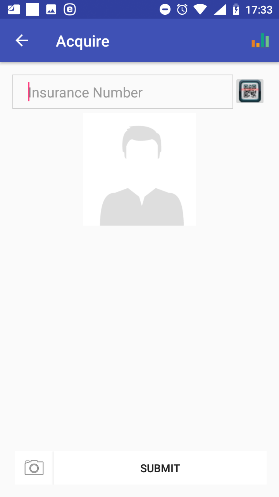
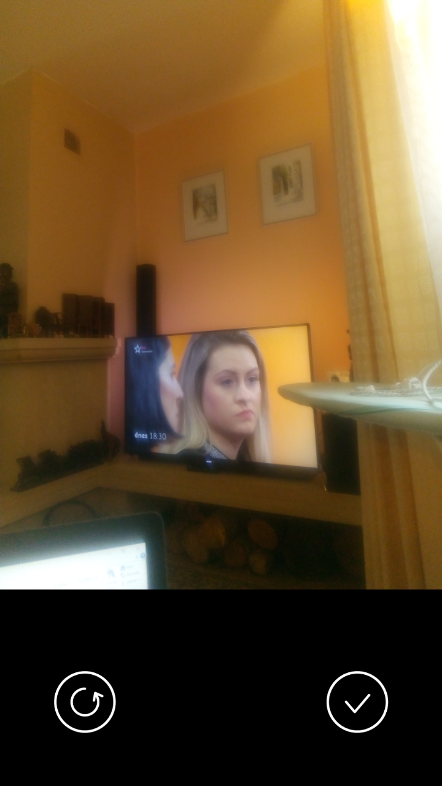

**Function Acquire**
--------------------

The function Acquire is navigated to by clicking on the menu item
**Acquire** in the main menu. The function Acquire allows to take a
photo of an insuree and to save the photo for subsequent assignment to
the data on the insuree. The `Acquire
Page <#image-1.3.1-acquire-page>`__ appears immediately:

Image 1.3.1 (Acquire Page)
^^^^^^^^^^^^^^^^^^^^^^^^^^

-  Insurance Number

..

   Either type in the insurance number of the insuree for whom a photo
   should be taken or obtain the insurance number by scanning of a QR
   code by clicking on the **QR** button.

Click on the icon **Photo** for taking a photo in left bottom corner of
the page. The `Photo Page <#image-1.3.2-photo-page>`__ appears.

Image 1.3.2 (Photo Page)
^^^^^^^^^^^^^^^^^^^^^^^^

Subsequently click on the button **Photo** for taking and the icon
Ch\ eck\ for accepting of the taken photo. Finally click on button
**Submit** on to the `Acquire Page <#image-1.3.1-acquire-page>`__ save
the acquired photo for further processing in the application.

   Click on the icon **<-** in the upper part of the `Acquire
   Page <#image-1.3.1-acquire-page>`__ to return to the `Home
   Page <#image-1.1.2-home-page>`__.