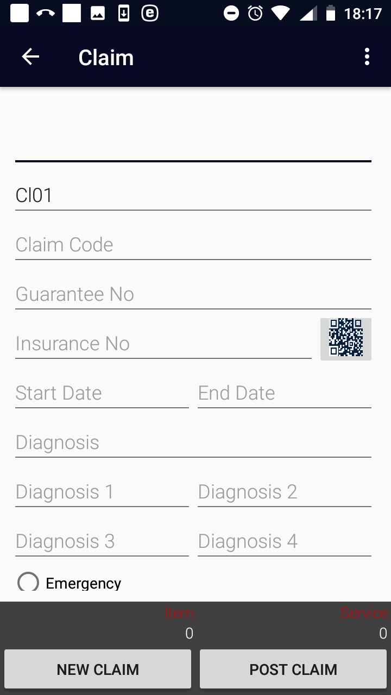
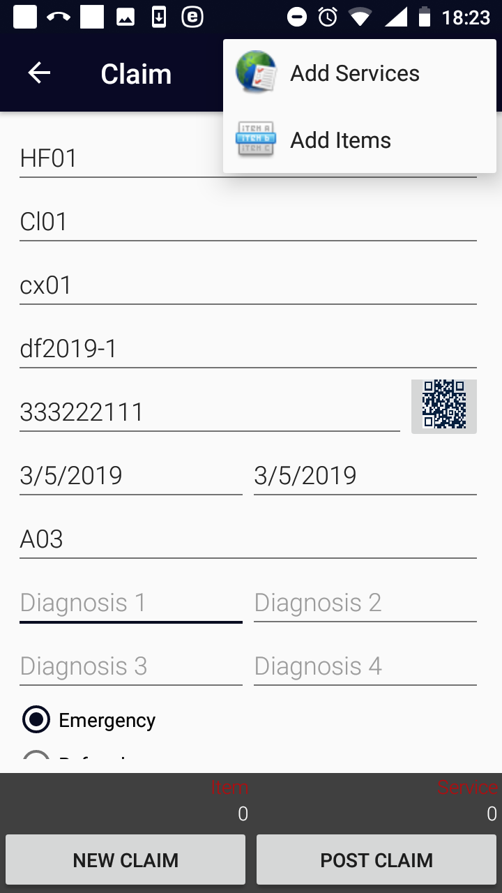
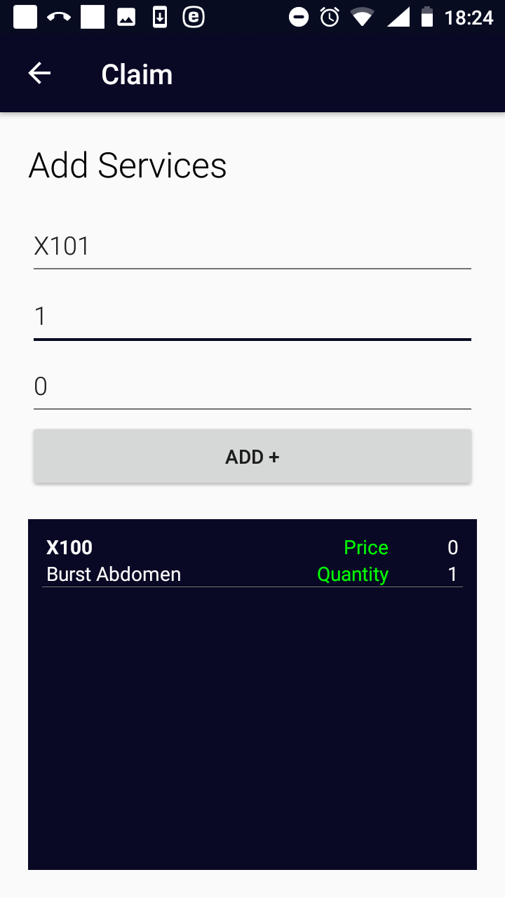
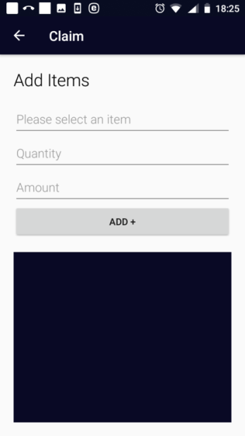

Function Claim
--------------

The function Claim is navigated to by clicking on the menu item
**Claim** in the main menu. The function Claim allows creating of claims
and posting them in the memory before uploading them to the web IMIS.
The `Claim Page <#image-2.3.1-map-services-page>`__ appears immediately:

Image 2.6.1 (Claim Page)
^^^^^^^^^^^^^^^^^^^^^^^^

The following data fields appear in the `Claim
Page <#image-2.6.1-claim-page>`__:

-  Health Facility Code

..

   The code of the health facility for which the claim is created. The
   data field is prefilled by the code of the health facility for which
   the claim administrator is acting. Mandatory.

-  Claim Admin

..

   The code of the claim administrator that is responsible for creation
   of the claim. The data field is prefilled by the code of the claim
   administrator with which the application is launched. Mandatory.

-  Claim Code

..

   The code of the claim that is created. Mandatory.

-  Guarantee No

..

   The identification of an guarantee document associated with the
   claim. Optional.

-  Insurance Number

..

   Either type in the insurance number of the insuree for whom the claim
   is created or obtain the insurance number by scanning of a QR code by
   clicking on the **QR** button. Mandatory.

-  Start Date

..

   Tap on the data field and select a starting date of a contact of the
   insuree with the health facility for which the claim is created in
   the date selector. Mandatory.

-  End Date

..

   Tap on the data field and select an ending date of a contact of the
   insuree with the health facility for which the claim is created in
   the date selector. By default it is pre-filled with the starting
   date. Optional.

-  Diagnosis

..

   Select a main diagnosis from the drop down list of available
   diagnoses. Mandatory.

-  Diagnosis 1-4

..

   Select a secondary diagnosis (up to four ones) from the drop down
   list of available diagnoses. Optional.

-  Visit Type

..

   Select just one of the options: **Emergency**, **Referral** ,
   **Other**. Mandatory.

Clicking on the <three dots vertically> icon in the upper right corner
of the `Claim
Page <#image-2.6.2-claim-page-the-menu-for-selection-of-the-list-of-medical-servicesitems>`__
the menu for selection of whether medical services/items should be
entered.

Image 2.6.2 (Claim Page – the menu for selection of the list of medical services/items)
^^^^^^^^^^^^^^^^^^^^^^^^^^^^^^^^^^^^^^^^^^^^^^^^^^^^^^^^^^^^^^^^^^^^^^^^^^^^^^^^^^^^^^^

Clicking on the menu item **Add Services** the `Add Services
Page <#image-2.6.3-add-services-page>`__ and the following data fields
appear.

Image 2.6.3 (Add Services Page)
^^^^^^^^^^^^^^^^^^^^^^^^^^^^^^^

-  Select Service

..

   Click on the data field and write a letter that is present in the
   code or the name of a medical service that should be included. A list
   of available services (that is prepared within the function `Map
   Services <#function-map-services>`__ or `Refresh
   Mapping <#function-refresh-mapping>`__) appears. Select an
   appropriate medical service from the list. Mandatory.

-  Quantity

..

   Enter the number of the medical service that should be included in
   the claim. The default is 1. Mandatory.

-  Amount

..

   Enter the price of the medical service that should be included in the
   claim. The price should be entered only if the medical service is
   designated in the corresponding definition of an insurance product in
   the web IMIS as a medical service with a price given by a health
   facility. Optional.

Click on the button **ADD+** to the medical service to the claim. Click
on the icon **<-** in the upper part of the `Add Services
Page <#image-2.6.3-add-services-page>`__ to return to the `Claim
Page. <#image-2.6.1-claim-page>`__

Clicking on the menu item **Add Items** the `Add Items
Page <#image-2.6.4-add-items-page>`__ and the following data fields
appear.

Image 2.6.4 (Add Items Page)
^^^^^^^^^^^^^^^^^^^^^^^^^^^^

-  Select Item

..

   Click on the data field and write a letter that is present in the
   code or the name of a medical item that should be included. A list of
   available items (that is prepared within the function `Map
   Items <#function-map-items>`__ or `Refresh
   Mapping <#function-refresh-mapping>`__) appears. Select an
   appropriate medical item from the list. Mandatory.

-  Quantity

..

   Enter the number of the medical item that should be included in the
   claim. The default is 1. Mandatory.

-  Amount

..

   Enter the price of the medical item that should be included in the
   claim. The price should be entered only if the medical item is
   designated in the corresponding definition of an insurance product in
   the web IMIS as a medical item with a price given by a health
   facility. Optional.

Click on the button **ADD+** to add the medical item to the claim.

Click on the icon **<-** in the upper part of the `Add Items
Page <#image-2.6.4-add-items-page>`__ to return to the `Claim
Page. <#image-2.6.5-claim-page>`__

   .. image:: media/image68.png

Image 2.6.5 (Claim Page)
^^^^^^^^^^^^^^^^^^^^^^^^

Click on the button **Post Claim** to save just created claim in the
memory of the device.

Click on the button **New Claim** to clear the data fields (with
exception Health Facility Code and Claim Admin) and to prepare the
`Claim Page <#image-2.6.5-claim-page>`__ to an entry of another claim.

Click on the icon **<-** in the upper part of the `Claim
Page <#image-2.6.5-claim-page>`__ to return to the `Home
Page <#image-2.1.2-home-page>`__ .

.. _function-reports-1: