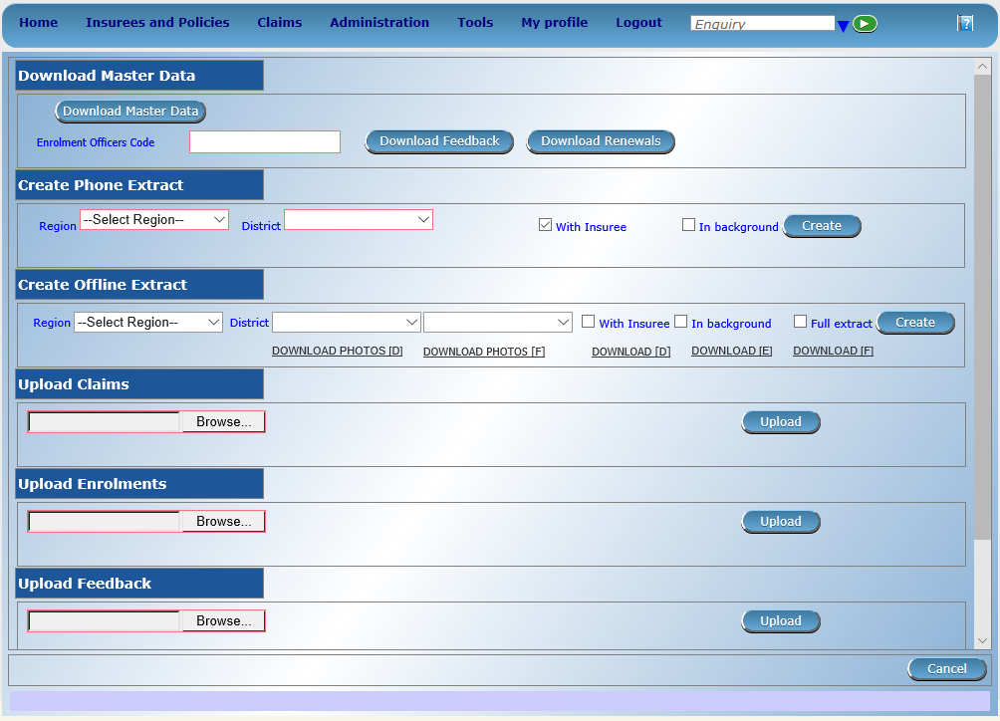
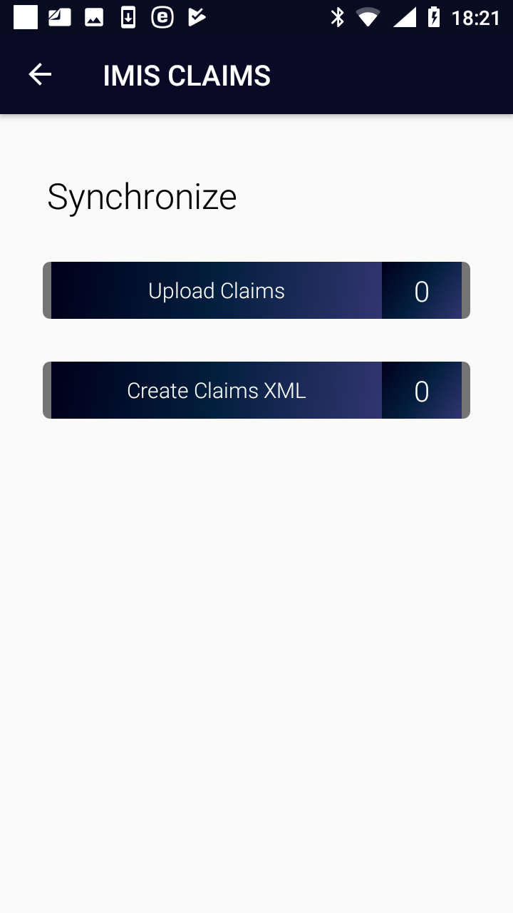

Off-line mode of IMIS Claims
----------------------------

The following table gives an overview of functions according to their
requirements towards Internet connectivity and possible off-line
substitutions.

+----------------------+------------------------+----------------------+
| IMIS Claims          |                        |                      |
+======================+========================+======================+
| Functionality        | connectivity required  | Off-line             |
|                      | /autonomous            | substitution         |
+----------------------+------------------------+----------------------+
| Initial launching    | connectivity required  | yes, by off-line     |
|                      |                        | transfer of a phone  |
|                      |                        | extract              |
+----------------------+------------------------+----------------------+
| Enquire              | connectivity required  | yes, by off-line     |
|                      |                        | transfer of a phone  |
|                      |                        | extract              |
+----------------------+------------------------+----------------------+
| Map Services         | autonomous             | not needed           |
+----------------------+------------------------+----------------------+
| Map Items            | autonomous             | not needed           |
+----------------------+------------------------+----------------------+
| Refresh Mapping      | connectivity required  | not available        |
+----------------------+------------------------+----------------------+
| Claim                | autonomous             | not needed           |
+----------------------+------------------------+----------------------+
| Reports              | autonomous             | not needed           |
+----------------------+------------------------+----------------------+
| Synchronize          | connectivity required  | yes, off-line        |
|                      |                        | synchronization by   |
|                      |                        | XML files            |
+----------------------+------------------------+----------------------+
| Quit                 | autonomous             | not needed           |
+----------------------+------------------------+----------------------+
| About                | autonomous             | not needed           |
+----------------------+------------------------+----------------------+

Creation and transfer of off-line files to IMIS Claims
~~~~~~~~~~~~~~~~~~~~~~~~~~~~~~~~~~~~~~~~~~~~~~~~~~~~~~

The off-line files for IMIS Claims is created in the web IMIS by
selecting of the **Tools/Extracts** menu item. The form IMISExtracts is
displayed.

Image 3.2.1 (IMISExtracts Form)
^^^^^^^^^^^^^^^^^^^^^^^^^^^^^^^

The Create Phone Extract section is used for creation of the off-line
file for IMIS Claims.

-  Region

..

   The region in which a health facility is located for which claims
   should be created.

-  District

..

   The district in which the health facility is located for which claims
   should be created.

-  With Insurees

..

   Check if the off-line file should contain data on insures (for the
   function `Enquiry <#function-enquire-1>`__).

-  In background

..

   Check if the off-line file should be created in background.

Click on the button:

-  **Create**

..

   The file IMISData.db3 is generated and it can be downloaded by
   clicking on the button **Download** which is dynamically created in
   the section

   The off-line file IMISData.db3 should be transferred to the device
   and stored in the folder IMIS.

Creation and transfer of off-line files from IMIS Claims
~~~~~~~~~~~~~~~~~~~~~~~~~~~~~~~~~~~~~~~~~~~~~~~~~~~~~~~~

Use the function `Synchronize <#image-3.2.1-synchronize-page>`__ and the
following buttons:

Image 3.2.1 (Synchronize Page)
^^^^^^^^^^^^^^^^^^^^^^^^^^^^^^

-  **Create Claims XML**

..

   Creates a file with all claims that haven’t been uploaded or included
   in a generated file yet.. The name of the file is Claims_<claim
   adminstrator code>_<date of creating>_<time of creating>.rar and it
   is stored in the folder IMIS in the device.

   .

The off-line files should be transferred to a client device of the web
IMIS and uploaded to the web IMIS by means of the `IMISExtracts
form <#image-3.1.1-imisextracts-form>`__ – in the section Upload Claims.

Remark
======

This version of the user manual relates to the version CHF-IMIS apps
that was derived from the Master Version of IMIS apps having in mind
specific requirements of the CHF health insurance scheme to the
terminology and the data fields to be used in IMIS. The text of the user
manual relates to the Master Version of IMIS. The following table shows
the differences in the terminology between the Master Version of IMIS
and the CHF-IMIS. A user has to have these differences in mind when
reading the text of this user manual.

The following table summarizes the adjustments in terminology for the
CHF-IMIS with respect to the Master Version of IMIS:

+------------------------------------+---------------------------------+
|    **IMIS Master Version**         |    **CHF-IMIS**                 |
+====================================+=================================+
|    Municipality                    |    Ward                         |
+------------------------------------+---------------------------------+
|    Insurance Number                |    CHF Number                   |
+------------------------------------+---------------------------------+

Further, the Master Version of IMIS uses some data fields that are not
used in CHF-IMIS. The overview of the data fields in the Master Version
not occurring in the CHF-IMIS is shown in the following table:

+------------------------------------+---------------------------------+
|    **IMIS Master Version**         |    **CHF-IMIS**                 |
+====================================+=================================+
|    Education                       |    Not used                     |
+------------------------------------+---------------------------------+
|    Profession                      |    Not used                     |
+------------------------------------+---------------------------------+
|    Confirmation                    |    Not used                     |
|                                    |                                 |
|    Type                            |                                 |
+------------------------------------+---------------------------------+
|    Confirmation No.                |    Not used                     |
+------------------------------------+---------------------------------+
|    Current Region                  | Not used                        |
+------------------------------------+---------------------------------+
|    Current District                | Not used                        |
+------------------------------------+---------------------------------+
|    Current Municipality            | Not used                        |
+------------------------------------+---------------------------------+
|    Current Village                 | Not used                        |
+------------------------------------+---------------------------------+
|    Current Address Details         | Not used                        |
+------------------------------------+---------------------------------+
|    Identification Type             | Not used                        |
+------------------------------------+---------------------------------+
|    Identification No.              | Not used                        |
+------------------------------------+---------------------------------+
|    Region of FSP                   | Not used                        |
+------------------------------------+---------------------------------+
|    District of FSP                 | Not used                        |
+------------------------------------+---------------------------------+
|    Level of FSP                    | Not used                        |
+------------------------------------+---------------------------------+
|    First Service Point             | Not used                        |
+------------------------------------+---------------------------------+
|    Relationship                    | Not used                        |
+------------------------------------+---------------------------------+
|    Beneficiary Card                | Not used                        |
+------------------------------------+---------------------------------+
|    Poverty Status                  | Not used                        |
+------------------------------------+---------------------------------+
|    Contribution Category           | Not used                        |
+------------------------------------+---------------------------------+

Besides, CHF-IMIS uses as the second language for the user interface
Swahili.
