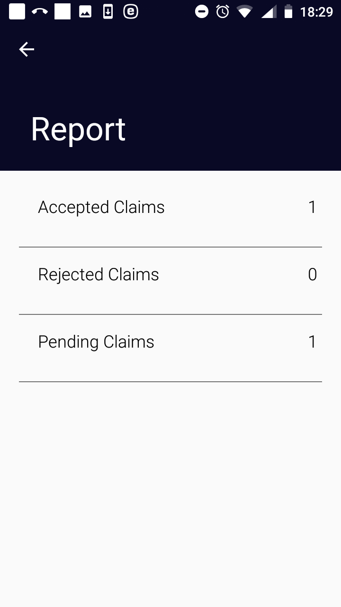

Function Reports
----------------

The function Reports is navigated to by clicking on the menu item
**Reports** in the main menu. The function Reports provides basic
statistics on the numbers of accepted, rejected and not yet uploaded
(pending) claims in the memory of the device (without respect to a claim
administrator). The `Report Page <#image-2.3.1-map-services-page>`__
appears immediately:

Image 2.7.1 (Report Page)
^^^^^^^^^^^^^^^^^^^^^^^^^