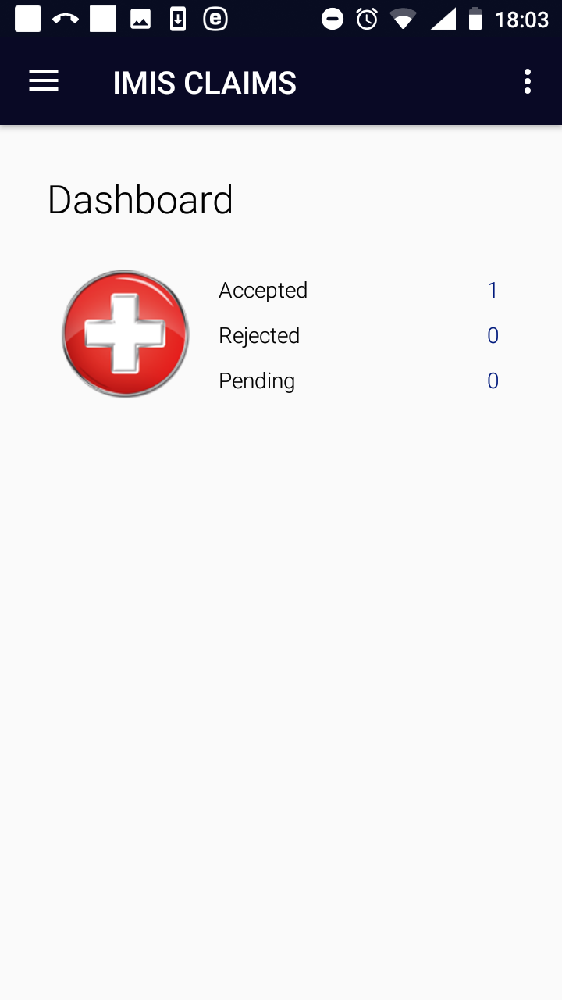

Launching of IMIS Claims
------------------------

To launch the application IMIS Claims just click on the icon of the
application. Users must have a valid code of a claim administrator
(entered in the register of claim administrators in the web IMIS) and
for selected functionalities must have a valid User Name and Password
provided by an administrator of the web IMIS. The User Name data field
in login pages is pre-filled with claim administrator code entered while
launching the application. The reason is that the web IMIS can create
automatically a user record simultaneously with an entry of a new claim
administrator into the register of claim administrators. Such
automatically created user has its User Name equal to the claim
administrator code. However, this pre-filled User Name can re-written by
any valid User Name.

The `Initial Page <#image-2.1.1-initial-page>`__ appears:

Image 2.1.1 (Initial Page)
^^^^^^^^^^^^^^^^^^^^^^^^^^

Enter a valid claim administrator code and click on the button
**Continue**. If a valid claim administrator code is entered, the
application will re-direct to the `Home Page <#image-2.1.2-home-page>`__

Image 2.1.2 (Home Page)
^^^^^^^^^^^^^^^^^^^^^^^

The statistics on the number of claims appears on the Home Page. The
statistics is split into the number of claims that were uploaded and
accepted by the web IMIS (Accepted), the number of claims uploaded but
rejected (Rejected) and the number of claims saved (posted) but not
uploaded yet (Pending) Quitting of the applications resets the
statistics.

Clicking on the <three dots vertically> icon in the upper right corner
the menu for selection of language of the user interface appears.

Clicking on the <three bars horizontally> icon in the upper left corner
the main menu of the application appears:

Image 2.1.3 (Main menu of the application)
^^^^^^^^^^^^^^^^^^^^^^^^^^^^^^^^^^^^^^^^^^

The menu items stand for the following functionalities:

`Home <#image-2.1.2-home-page>`__ – return to the Home Page

`Enquire <#function-enquire-1>`__ – getting a photo and information on
the coverage of an insure

`Map Services <#function-map-services>`__ – creation of a selected list
of medical services guiding entry of services in claims

`Map Items <#function-map-items>`__ – creation of a selected list of
medical items guiding entry of items in claims

`Refresh Mapping <#function-refresh-mapping>`__ – automatic creation of
selected lists of medical services/items according to pricelists valid
for the health facility for which the claim administrator is acting

`Claim <#function-claim>`__ – entering and posting of claims

`Reports <#function-reports-1>`__ – creation of reports relating to
activities of the claim administrator

`Synchronize <#function-synchronize-1>`__ – uploading data to the web
IMIS

`Quit <#function-quit-1>`__ –quitting of the application

`About <#function-about-1>`__ – info on the version of the installed
application

.. _function-enquire-1: