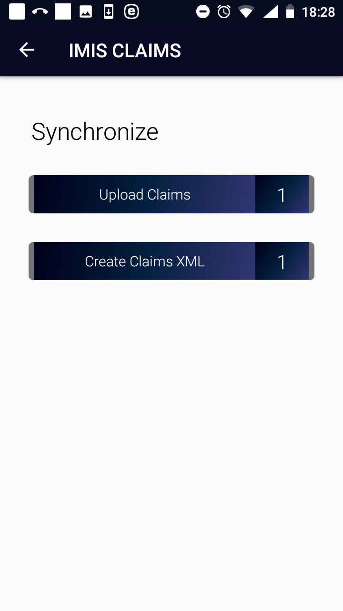
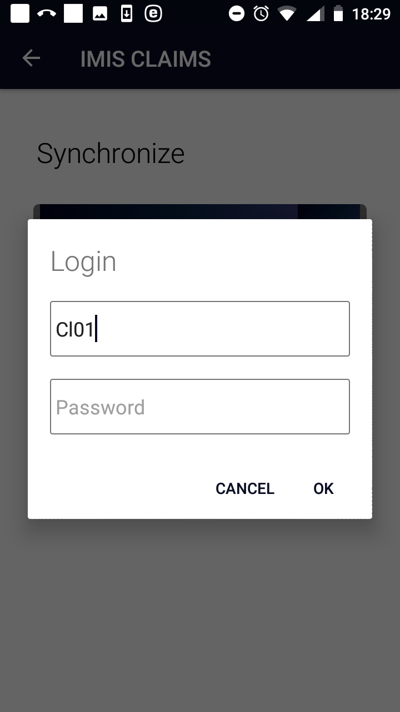
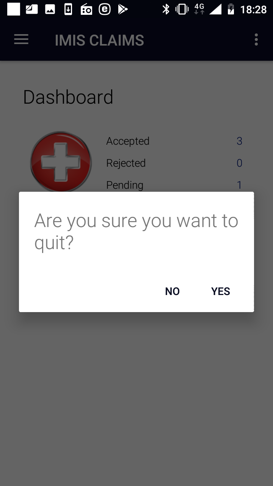
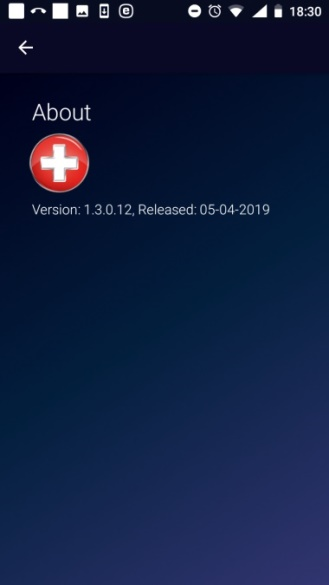

.. _function-synchronize-1:

Function Synchronize
--------------------

The function Synchronize is navigated to by clicking on the menu item
**Synchronize** in the main menu. The function Synchronize uploads
posted claims to the web IMIS. For on-line uploading a user must have a
valid User Name and Password provided by an administrator of the web
IMIS with an assigned role incorporating an access to the functionality
**Claims/Claim/Add** as an access to the functionality Synchronize is
guarded by the `Login Page <#image-1.2.1-enquire-function-login-page>`__
for on-line uploads.

The `Synchronize Page <#image-2.3.1-map-services-page>`__ appears
immediately:

Image 2.8.1 (Synchronize Page)
^^^^^^^^^^^^^^^^^^^^^^^^^^^^^^

There are two buttons:

**Upload Claims** for on-line uploading of saved claims to the web IMIS.

**Create Claims XML** for generation of a file (in the XML format) for
off-line uploading of saved claims to the web IMIS-see `the off-line
mode of IMIS Claims <#off-line-mode-of-imis-claims>`__.

On-line uploading of claims is guarded by the Login Page:

Image 2.8.2 (Synchronize Page-Login Page)
^^^^^^^^^^^^^^^^^^^^^^^^^^^^^^^^^^^^^^^^^

If the login process is successful then click on the **Upload Claims**
button to upload claims to the web IMIS. Claims that are successfully
uploaded are saved in the folder IMIS/Accepted Claims. Unseccussfully
uploaded claimes are saved in the folder IMIS/Rejected Claims.

.. _function-quit-1:

Function Quit
-------------

The function Quit is navigated to by clicking on the menu item **Quit**
in the main menu. . The function Quit quits the application after `Quit
Confirmation <#image-1.11.1-quit-confirmation-prompt>`__.

Image 2.9.1 (Quit Confirmation)
^^^^^^^^^^^^^^^^^^^^^^^^^^^^^^^

.. _function-about-1:

Function About
--------------

The function About is navigated to by clicking on the menu item
**About** in the main menu. The function About provides information
about the application itself. The `About
Page <#image-2.10.1-about-page>`__ appears immediately:

Image 2.10.1 (About Page)
^^^^^^^^^^^^^^^^^^^^^^^^^

Click on the icon **<-** in the upper part of the `About
Page <#image-2.10.1-about-page>`__ to return to the `Home
Page. <#image-2.1.2-home-page>`__

Off-line mode of the applications
=================================

The applications IMIS Policies and IMIS Claims require for certain
functions Internet connectivity for communication with the web IMIS.
Other functions of both applications can be used autonomously without
availability of Internet connectivity. There is a possibility to move to
a place where Internet connectivity is ensured only for time when
functions requiring Internet connectivity are used (e.g. initialization
of an application, synchronization etc.) and use autonomous functions in
settings without Internet connectivity. However, this may not be
practical or even possible in all situations. Therefore, there is a
possibility to substitute on-line connection for some functions by
off-line transfer of files from/to the web IMIS. Thus, utilization of
the application in an environment without Internet connectivity is
guaranteed.