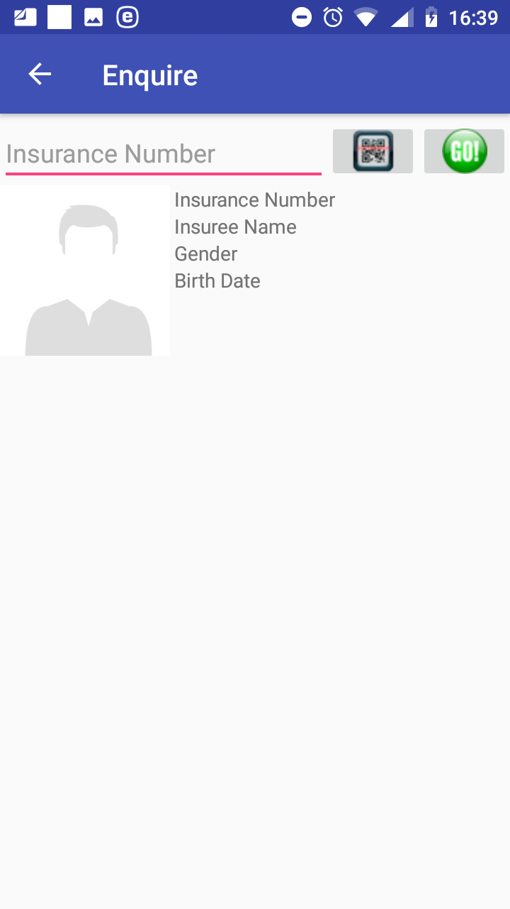

**Function Enquire**
--------------------

The function Enquire is navigated to by clicking on the menu item
**Enquire** in the main menu. The function Enquire provides a photo and
information of insurance coverage of a specified insuree. A user must
have a valid User Name and Password provided by an administrator of the
web IMIS with an assigned role incorporating an access to the
functionality **Insurees and Familiies/Insurees/Enquire** as an access
to the functionality Enquire is guarded by the `Login
Page <#image-2.2.1-enquire-function-login-page>`__ .

.. image:: media/image58.png

Image 2.2.1 (Claim Enquire function –Login Page)
^^^^^^^^^^^^^^^^^^^^^^^^^^^^^^^^^^^^^^^^^^^^^^^^

Image 1.2.1 (Policy Enquire function –Login Page)
^^^^^^^^^^^^^^^^^^^^^^^^^^^^^^^^^^^^^^^^^^^^^^^^^

The User Name data field is pre-filled by the enrolment officer or claim admin code
with which the installation has been launched. However, the User Name
data field can re-written by any valid User Name. This principle is
valid all other login pages of the IMIS Policies application. If the
application successfully logs in the `Enquire

If the application successfully logs in successfully the `Enquire
Page <#image-2.2.2-enquire-page>`__ appears:

.. image:: media/image59.png

Image 2.2.2 (Claim Enquire Page)
^^^^^^^^^^^^^^^^^^^^^^^^^^^^^^^^

Image 1.2.2 (Policy Enquire Page)
^^^^^^^^^^^^^^^^^^^^^^^^^^^^^^^^^

-  Insurance Number

..

   Either type in the insurance number of the insuree for whom
   identification and coverage data are to be retrieved or obtain the
   insurance number by scanning of a QR code by clicking on the **QR**
   button.

Click on the button **GO!** for retrieving the identification and
coverage data.

If the insuree with the insurance number has been already entered in the
web IMIS the following data appear on the `Enquiry
Page <#image-2.2.3-enquiry-page-provided-data-on-an-insuree>`__ :

Image 2.2.3 (Claim Enquiry Page-provided data on an insuree)
^^^^^^^^^^^^^^^^^^^^^^^^^^^^^^^^^^^^^^^^^^^^^^^^^^^^^^^^^^^^

Image 1.2.3 (Policy Enquiry Page-provided data on an insuree)
^^^^^^^^^^^^^^^^^^^^^^^^^^^^^^^^^^^^^^^^^^^^^^^^^^^^^^^^^^^^^

-  Photo of the insuree if the photo has been stored in the web IMIS

-  Insurance Number

-  Insuree Name

-  Gender

-  Birth Date

..

   For each policy by which the insuree is covered the following data
   are shown:

-  Insurance Product Code

-  Insurance Product Name

-  Expiry Date of the Policy

-  Status of the Policy

..

   Click on the icon **<-** in the upper part of the `Enquire
   Page <#image-2.2.2-enquire-page>`__ to return to the `Home
   Page <#image-2.1.2-home-page>`__ .