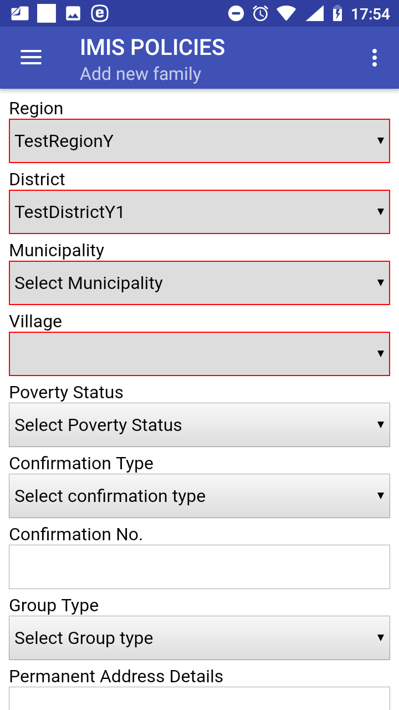
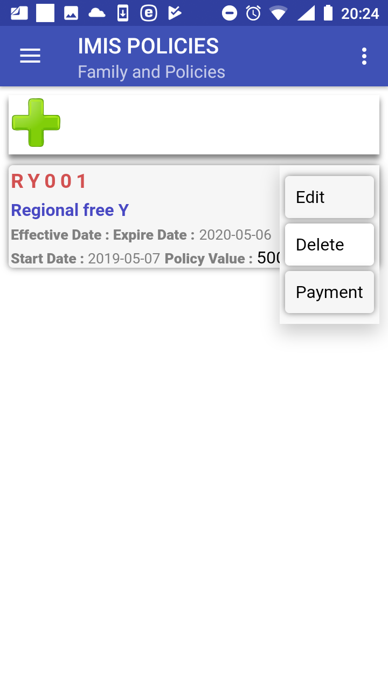

**Function Enrol**
------------------

The function Enrol is navigated to by clicking on the menu item
**Enrol** in the main menu. The function Enrol allows to enter data on
new families/insurees/policies/contributions and/or modify data on
families/insurees downloaded from the web IMIS. The `Families
Page <#image-1.3.1-acquire-page>`__ appears immediately:

Image 1.4.1 (Families Page)
^^^^^^^^^^^^^^^^^^^^^^^^^^^

To add a new family click on the icon **+**. The `Add new family
Page <#image-1.4.2-add-new-family-page>`__ appears.

Image 1.4.2 (Add new family Page)
^^^^^^^^^^^^^^^^^^^^^^^^^^^^^^^^^

The following data fields appear:

-  Region

..

   The region of residence of a new family/group. The data field is
   initialized by the region of activity of the enrolment officer in
   accordance with the register of enrolment officers in the web IMIS.
   Mandatory.

-  District

..

   The district of the residence of the new family/group. The data field
   is initialized by the district of activity of the enrolment officer
   in accordance with the register of enrolment officers in the web
   IMIS. Mandatory.

-  Municipality

..

   The municipality of the residence of the new family/group. The data
   field is initialized by the municipality of activity of the enrolment
   officer in accordance with the register of enrolment officers in the
   web IMIS. If the enrolment officer is active in more municipalities
   of the district then the drop down list associated with the data
   field is modified accordingly. Mandatory.

-  Village

..

   The village of residence of the new family/group. The data field is
   initialized by the village of activity of the enrolment officer in
   accordance with the register of enrolment officers in the web IMIS.
   If the enrolment officer is active in more villages of the
   municipality then the drop down list associated with the data field
   is modified accordingly. Mandatory.

-  Poverty Status

..

   Select one of the offered options from the drop down list associated
   with the data field. Optional.

-  Confirmation Type

..

   Select one of the offered options for the type of confirmation
   document from the drop down list associated with the data field.
   Optional.

-  Confirmation No.

..

   Enter an identification of a confirmation document. Optional.

-  Group Type.

..

   Select one of the offered options for the type of the group from the
   drop down list associated with the data field. Optional.

-  Permanent Address Details.

..

   Enter further details to the address of residence of the
   family/group. Optional.

   Click on the button **Next** to navigate to the `Add/Edit Insuree
   Page <#image-1.4.3-addedit-insuree-page>`__.

Image 1.4.3 (Add/Edit Insuree Page)
^^^^^^^^^^^^^^^^^^^^^^^^^^^^^^^^^^^

The following data fields appear:

-  Insurance Number

..

   Either enter the insurance number of the head of the family/group or
   obtain the insurance number by scanning of a QR code by clicking on
   the **QR** button. Mandatory.

-  Other Names

..

   Enter other names of the head of the family/group. Mandatory.

-  Last Name

..

   Enter a last name of the head of the family/group. Mandatory.

-  Photo area

..

   Either previously acquired photo of the head of the family/group is
   inserted automatically based on the equality of the Insurance Number
   here and of the Insurance Number from the `Acquire
   Page <#image-1.3.1-acquire-page>`__ or tap in the photo area and
   choose a photo from your folder in the device. A photo must be
   assigned otherwise the family/group cannot be uploaded to the web
   IMIS. Mandatory.

-  Birth Date

..

   Tap on the data field and select a birth date of the head of the
   family/group in the date selector. Mandatory.

-  Gender

..

   Select the gender of the head of the family/group from the drop down
   list. Mandatory.

-  Marital Status

..

   Select the marital status of the head of the family/group from the
   drop down list. Optional.

-  Beneficiary Card

..

   Select from the drop down list whether a beneficiary card was given
   to the head of the family/group. Optional.

-  Current Region

..

   Region of a current residence of the head of the family/group if it
   differs from the permanent residence. Optional.

-  Current District

..

   District of a current residence of the head of the family/group if it
   differs from the permanent residence. Optional.

-  Current Municipality

..

   Municipality of a current residence of the head of the family/group
   if it differs from the permanent residence. Optional.

-  Current Village

..

   Village of a current residence of the head of the family/group if it
   differs from the permanent residence. Optional.

-  Current Address Details

..

   Address details of a current residence of the head of the
   family/group if it differs from the permanent residence. Optional.

-  Profession

..

   Select one of the offered options for profession of the head of the
   family/group. Optional.

-  Education

..

   Select one of the offered options for education of the head of the
   family/group. Optional.

-  Phone Number

..

   Enter a phone number of the head of the family/group. Optional.

-  Email

..

   Enter an email of the head of the family/group. Optional.

-  Identification Type

..

   Select one of the offered options for the type of an identity
   document of the head of the family/group. Optional.

-  Identification Number

..

   Enter an identification of identity document of the head of the
   family/group. Optional.

-  Region of FSP

..

   Region of a First Service Point of the head of the family/group.
   Optional.

-  District of FSP

..

   District of the First Service Point of the head of the family/group.
   Optional.

-  Level of FSP

..

   Select the level of a health facility that serves as the First
   Service Point of the head of the family/group. Optional.

-  First Service Point

..

   Select the health facility that serves as the First Service Point of
   the head of the family/group. Optional.

Click on the button **Save** to save the data of the head of the
family/group in the memory of the device. The `Family and Insurees
Page <#image-1.4.4-family-and-insurees-page>`__ is displayed after a
successful saving:

Image 1.4.4 (Family and Insurees Page)
^^^^^^^^^^^^^^^^^^^^^^^^^^^^^^^^^^^^^^

There are four options now:

a) Editing or deleting of the head of family/group.

b) Adding a new family/group

c) Adding a new member to the family/group.

d) Assigning of a new policy to the family/group.

Editing or deleting of a family/group 
~~~~~~~~~~~~~~~~~~~~~~~~~~~~~~~~~~~~~

By clicking on the icon **<three vertical dots>** with the head of the
family/group in the `Family and Insurees
Page <#image-1.4.5-family-and-insurees-page-the-menu-associated-with-the-head>`__
a menu appears with options of editing of the data of the head of the
family or of deleting of the head of the family/group.

Image 1.4.5 (Family and Insurees Page-the menu associated with the head)
^^^^^^^^^^^^^^^^^^^^^^^^^^^^^^^^^^^^^^^^^^^^^^^^^^^^^^^^^^^^^^^^^^^^^^^^

Selecting the item **Delete** an alert box appears saying that the head
of a family/group cannot be deleted in this situation. This possible
only in the context of the `Families
Page <#image-1.4.1-families-page>`__ where it is considered as deleting
of the whole family/group.

Selecting the item **Edit** the `Add/Edit Insuree
Page <#image-1.4.6-addedit-insuree-page>`__ appears with the data of the
head of a family/group that should be edited.

Image 1.4.6 (Add/Edit Insuree Page)
^^^^^^^^^^^^^^^^^^^^^^^^^^^^^^^^^^^

Click on the button **Save** to save the edited data of the head of the
family/group in the memory of the local device. The `Family and Insurees
Page <#image-1.4.4-family-and-insurees-page>`__ is displayed after a
successful saving.

Adding a new family/group
~~~~~~~~~~~~~~~~~~~~~~~~~

Clicking on the <three bars horizontally> icon (the upper left corner of
the `Family and Insurees Page <#image-1.4.4-family-and-insurees-page>`__
) the main menu of the application appears. Select **Enrol** to navigate
to the `Families Page <#image-1.4.7-families-page>`__.

.. image:: media/image16.png

Image 1.4.7 (Families Page)
^^^^^^^^^^^^^^^^^^^^^^^^^^^

By clicking on the icon **+** in the `Families
Page <#image-1.4.4-family-and-insurees-page>`__ the `Add new family
Page <#image-1.4.2-add-new-family-page>`__ appears and a new head of a
family/group can be added.

Adding a new member of a family/group
~~~~~~~~~~~~~~~~~~~~~~~~~~~~~~~~~~~~~

By clicking on the icon **+** in the `Family and Insurees
Page <#image-1.4.4-family-and-insurees-page>`__ the `Add/Edit Insuree
Page <#image-1.4.8-addedit-insuree-page>`__ appears and a new member of
the family/group can be added.

Image 1.4.8 (Add/Edit Insuree Page)
^^^^^^^^^^^^^^^^^^^^^^^^^^^^^^^^^^^

The following data fields appear:

-  Relationship

..

   Select one of the offered relationships of the member to the head of
   the family/group. Mandatory.

-  Insurance Number

..

   Either enter the insurance number of the member of the family/group
   or obtain the insurance number by scanning of a QR code by clicking
   on the **QR** button. Mandatory.

-  Other Names

..

   Enter other names of the member of the family/group. Mandatory.

-  Last Name

..

   Enter the last name of the member of the family/group. Mandatory.

-  Photo area

..

   Either previously acquired photo of the member of the family/group is
   inserted automatically based on the equality of the Insurance Number
   here and of the Insurance Number from the `Acquire
   Page <#image-1.3.1-acquire-page>`__ or tap in the photo area and
   choose a photo from your folder in the device. A photo must be
   assigned otherwise the family/group cannot be uploaded to the web
   IMIS. Mandatory.

-  Birth Date

..

   Tap on the data field and select a birth date of the member of the
   family/group in the date selector. Mandatory.

-  Gender

..

   Select a gender of the member of the family/group from the drop down
   list. Mandatory.

-  Marital Status

..

   Select the marital status of the member of the family/group from the
   drop down list. Optional.

-  Beneficiary Card

..

   Select from the drop down list whether a beneficiary card was given
   to the member of the family/group. Optional.

-  Current Region

..

   Region of a current residence of the member of the family/group if it
   differs from the permanent residence of the member of the
   family/group. Optional.

-  Current District

..

   District of a current residence of the member of the family/group if
   it differs from the permanent residence of the member of the
   family/group. Optional.

-  Current Municipality

..

   Municipality of a current residence of the member of the family/group
   if it differs from the permanent residence of the member of the
   family/group. Optional.

-  Current Village

..

   Village of a current residence of the member of the family/group if
   it differs from the permanent residence of the member of the
   family/group. Optional.

-  Current Address Details

..

   Address details of a current residence of the member of the
   family/group if it differs from the permanent residence of the member
   of the family/group. Optional.

-  Profession

..

   Select one of the offered options for profession of the member of the
   family/group. Optional.

-  Education

..

   Select one of the offered options for education of the member of the
   family/group. Optional.

-  Phone Number

..

   Enter a phone number of the member of the family/group. Optional.

-  Email

..

   Enter an email of the member of the family/group. Optional.

-  Identification Type

..

   Select one of the offered options for the type of an identity
   document of the member of the family/group. Optional.

-  Identification Number

..

   Enter an identification of identity document of the member of the
   family/group. Optional.

-  Region of FSP

..

   Region of a First Service Point of the member of the family/group.
   Optional.

-  District of FSP

..

   District of the First Service Point of the member of the
   family/group. Optional.

-  Level of FSP

..

   Select the level of a health facility that serves as the First
   Service Point of the member of the family/group. Optional.

-  First Service Point

..

   Select the health facility that serves as the First Service Point of
   the member of the family/group. Optional.

Click on the button **Save** to save the data on the member of the
family/group in the memory of the device. The `Family and Insurees
Page <#image-1.4.4-family-and-insurees-page>`__ is displayed after a
successful saving:

Image 1.4.9 (Family and Insurees Page)
^^^^^^^^^^^^^^^^^^^^^^^^^^^^^^^^^^^^^^

There are three options now:

a) Adding again a new member the family/group (just click on the icon
**+** in the `Family and Insurees
Page) <#image-1.4.9-family-and-insurees-page>`__.

b) Editing or deleting of a member (just click on the icon **<three
vertical dots>** with a member in the `Family and Insurees
Page <#image-1.4.9-family-and-insurees-page>`__ a menu appears with
options of editing of the data of the member or of deleting of a member
of the family/group.

c) Assigning a new policy to the family/group.

Assigning of a policy 
~~~~~~~~~~~~~~~~~~~~~

By clicking on the button **Policy** the `Family and Policies
Page <#image-1.4.10-family-and-policies-page>`__ appears and a new
policy can by assigned to the family/group.

Image 1.4.10 (Family and Policies Page)
^^^^^^^^^^^^^^^^^^^^^^^^^^^^^^^^^^^^^^^

Click on the icon **+** to navigate to the `Add/Edit Policies
Page <#image-1.4.11-addedit-policies-page>`__:

Image 1.4.11 (Add/Edit Policies Page)
^^^^^^^^^^^^^^^^^^^^^^^^^^^^^^^^^^^^^

The following data fields appear:

-  Enrolment Date

..

   Tap on the data field and select an enrolment date for the policy in
   the date selector. Mandatory.

-  Product

..

   Select one of the offered insurance products for the policy.
   Mandatory.

-  Effective date

..

   Read-only calculated data field. Contains the date of effective
   starting of the policy taking into account all features of the
   selected insurance products and the date of payment of a
   contribution.

-  Start Date

..

   Assumed starting date of the policy without taking into account the
   date of payment of the contribution. Calculated data field based on
   the enrolment date and the selected insurance product that can be
   modified. Mandatory.

-  Expiry Date

..

   Assumed expiry date of the policy without taking into account the
   date of payment of the contribution. Calculated data field based on
   the starting date and the selected insurance product that can be
   modified. Mandatory.

-  Policy Status

..

   Read-only data field. Assigned policy status on the device. Actual
   policy status can change in the web IMIS after uploading.

-  Policy Value

..

   Read-only data field. Calculated policy value that should be covered
   by contributions.

-  Contribution

..

   Read-only data field. Calculated value of already assigned
   contributions.

-  Balance

..

   Read-only data field. Calculated value of the balance Policy Value -
   Contribution

Click on the button **Save** to save the data on the policy in the
memory of the device. The `Family and Policies
Page <#image-1.4.12-family-and-policies-page>`__ is displayed after a
successful saving.

Image 1.4.12 (Family and Policies Page)
^^^^^^^^^^^^^^^^^^^^^^^^^^^^^^^^^^^^^^^

There are three options now:

a) Assigning a new policy to the family/group (just by clicking on the
icon **+** in the `Family and Policies
Page <#image-1.4.12-family-and-policies-page>`__ the `Add/Edit Policy
Page <#image-1.4.11-addedit-policies-page>`__ appears and the new policy
can be assigned).

b) Editing or deleting of the policy.

c) Assigning a new contribution to the policy.

Editing or deleting of a policy 
~~~~~~~~~~~~~~~~~~~~~~~~~~~~~~~

By clicking on the icon **<three vertical dots>** with the policy in the
`Family and Policies
Page <#image-1.4.13-families-and-policies-page-the-menu-associated-with-the-policy>`__
a menu appears with options of editing of the data of the policy or of
deleting of the policy.

Image 1.4.13 (Families and Policies Page-the menu associated with the policy)
^^^^^^^^^^^^^^^^^^^^^^^^^^^^^^^^^^^^^^^^^^^^^^^^^^^^^^^^^^^^^^^^^^^^^^^^^^^^^

By selecting **Edit** the `Add/Edit Policy
Page <#image-1.4.13-families-and-policies-page-the-menu-associated-with-the-policy>`__
appears and the data of the policy can be edited. By selecting
**Delete** the `Confirmation
Box <#image-1.4.14-families-and-policies-page-confirmation-of-deleting>`__
appears that asks for a confirmation of the deleting. Deleting a policy
means also deleting of all contributions associated with the policy.

Image 1.4.14 (Families and Policies Page-confirmation of deleting)
^^^^^^^^^^^^^^^^^^^^^^^^^^^^^^^^^^^^^^^^^^^^^^^^^^^^^^^^^^^^^^^^^^

The `Family and Policies
Page <#image-1.4.10-family-and-policies-page>`__ is displayed after a
successful deleting.

Assigning of a new contribution to the policy 
~~~~~~~~~~~~~~~~~~~~~~~~~~~~~~~~~~~~~~~~~~~~~

By clicking on the icon **<three vertical dots>** with the policy in the
`Family and Policies
Page <#image-1.4.13-families-and-policies-page-the-menu-associated-with-the-policy>`__
a menu appears with options of editing of the data of the policy, of
deleting of the policy and assigning a contribution (**Payment**).
Select **Payment**. The `Contribution
Page <#image-1.4.13-families-and-policies-page-the-menu-associated-with-the-policy>`__
appears:

Image 1.4.15 (Contribution Page)
^^^^^^^^^^^^^^^^^^^^^^^^^^^^^^^^

Click on the **+** icon to add a new contribution. The `Add/Edit
Contribution Page <#image-1.4.16-addedit-contribution-page>`__ appears
with the following data fields:

Image 1.4.16 (Add/Edit Contribution Page)
^^^^^^^^^^^^^^^^^^^^^^^^^^^^^^^^^^^^^^^^^

-  Payer

..

   Either leave it blank or select one of the offered payers of the
   contribution. Optional.

-  Contribution Category

..

   Select one of the offered categories for the contribution. Mandatory.

-  Contribution Paid

..

   The amount of the contribution. If the Contribution and Others is
   selected in the data field Contribution Category then the data field
   Contribution Paid is prefilled by the amount still to be paid to
   reach the policy value. Mandatory.

-  Receipt No

..

   An identification of the receipt issued for the paid contribution.
   Mandatory.

-  Payment Date

..

   Tap on the data field and select a payment date of the contribution
   in the date selector. Mandatory.

-  Payment Type

..

   Select one of the offered types of payment of the contribution.
   Mandatory.

-  Policy Status

..

   Read-only data field. Assigned policy status in the device. Actual
   policy status can change in the web IMIS after uploading.

-  Policy Value

..

   Read-only data field. Calculated policy value that should be covered
   by contributions.

-  Contribution

..

   Read-only data field. Calculated value of already assigned
   contributions.

-  Balance

Read-only data field. Calculated value of the balance Policy Value –
Contribution

Click on the button **Save** to save the data on the contribution in the
memory of the device. The `Contribution
Page <#image-1.4.17-contribution-page>`__ is displayed after a
successful saving:

Image 1.4.17 (Contribution Page)
^^^^^^^^^^^^^^^^^^^^^^^^^^^^^^^^

There are three options now:

a) Assigning a new contribution to the same policy (just by clicking on
the icon + the `Add/Edit Contribution
Page <#image-1.4.16-addedit-contribution-page>`__ appears and a new
contribution can be added)

b) Editing or deleting of the contribution.

c) Adding of a new family or editing existing ones.

Editing or deleting of the contribution 
~~~~~~~~~~~~~~~~~~~~~~~~~~~~~~~~~~~~~~~

By clicking on the icon **<three vertical dots>** with the contribution
in the `Contribution
Page <#image-1.4.18-contribution-page-the-menu-associated-with-the-contribution>`__
a menu appears with options of editing of the data of the contribution
and of deleting of the contribution.

Image 1.4.18 (Contribution Page-the menu associated with the contribution)
^^^^^^^^^^^^^^^^^^^^^^^^^^^^^^^^^^^^^^^^^^^^^^^^^^^^^^^^^^^^^^^^^^^^^^^^^^

By selecting **Edit** the `Add/Edit Contribution
Page <#image-1.4.16-addedit-contribution-page>`__ appears and the data
of the contribution can be edited. By selecting **Delete** the
contribution is deleted without a confirmation prompt.