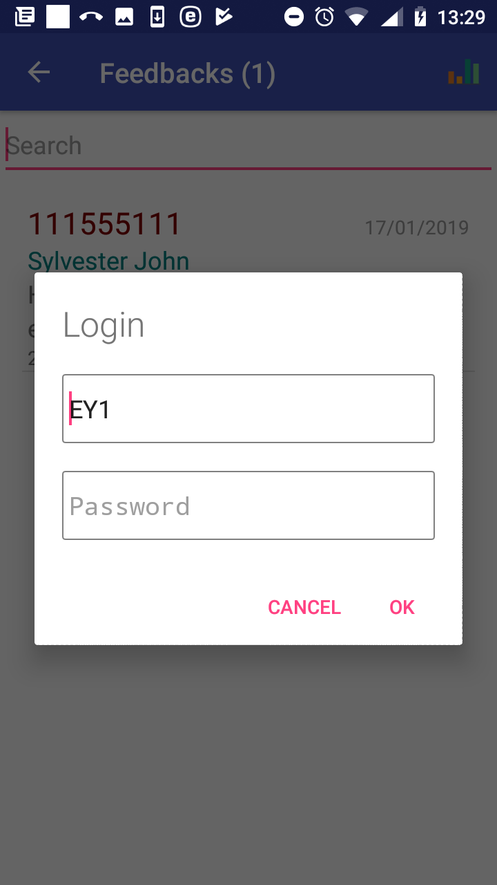
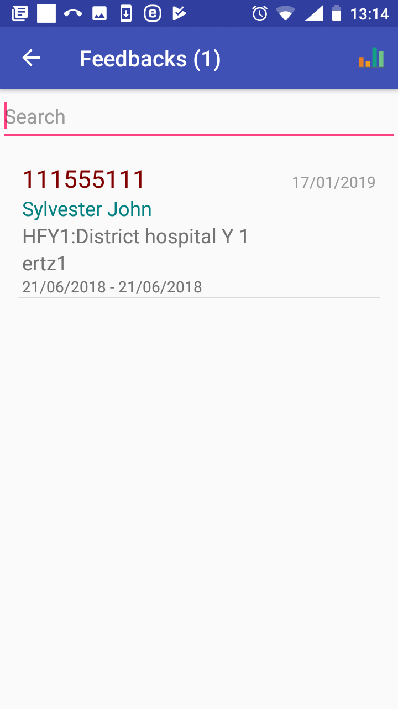
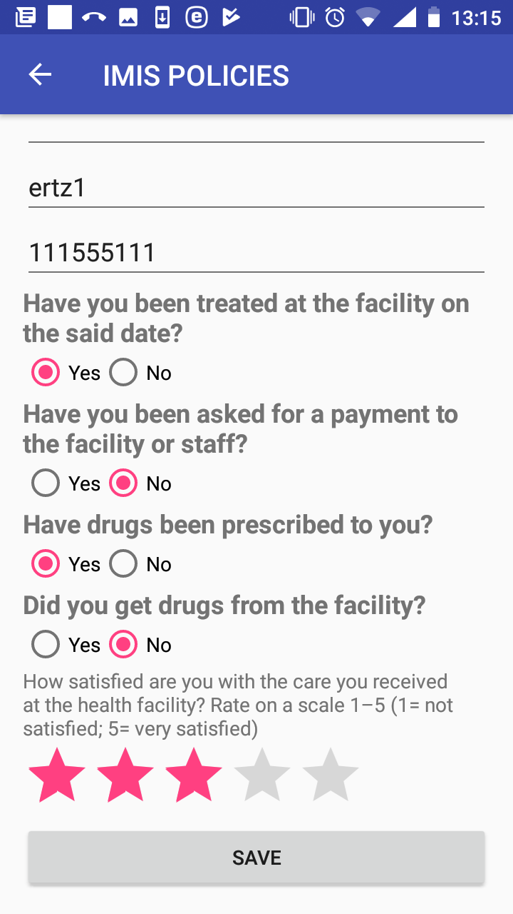

**Function Feedback**
---------------------

The function Feedback is navigated to by clicking on the menu item
**Feedback** in the main menu. The function Feedback allows getting of
prompts for feedbacks on claims from the web IMIS and saving (posting)
of feedbacks. A user must have a valid User Name and Password provided
by an administrator of the web IMIS with an assigned role incorporating
an access to the functionality **Claims/Claim/Feedback** as an access to
the functionality Renew is guarded by the `Login
Page <#image-1.2.1-enquire-function-login-page>`__ .

The `Feedbacks Page <#image-1.8.1-feedbacks-page>`__ appears after
selecting **Feedbacks** in the main menu.

Image 1.8.1 (Feedbacks Page)
^^^^^^^^^^^^^^^^^^^^^^^^^^^^

Swapping around the `Feedbacks Page <#image-1.8.1-feedbacks-page>`__
leads to the `Login Page <#image-1.7.2-renewals-page-login-page>`__ and
after a successful login shows feedback prompts transferred from the web
IMIS.

Image 1.8.2 (Feedbacks Page-Login Page)
^^^^^^^^^^^^^^^^^^^^^^^^^^^^^^^^^^^^^^^

The `Feedbacks
Page <#image-1.8.3-feedbacks-page-with-displayed-prompts>`__ with
prompts for acquiring feedbacks appears after the swap and the
successful login.

Image 1.8.3 (Feedbacks Page with displayed prompts)
^^^^^^^^^^^^^^^^^^^^^^^^^^^^^^^^^^^^^^^^^^^^^^^^^^^

The list of prompts can be temporarily reduced by entering a string in
the **Search** field. Each feedback prompt contains the following data
items:

-  Insurance Number

..

   The insurance number of a patient.

-  Name and Other Names

..

   The full name of the patient.

-  Code and Name of Health Facility

..

   The identification of a health facility that provided health care for
   which the feedback is asked.

-  Code of Claim

..

   The identification of a claim for which the feedback is asked.

-  Period

..

   The period in which health care was provided.

Clicking on a selected prompt results in displaying of the `Feedback
Page <#image-1.7.4-renew-page---a-specific-prompt>`__.

Image 1.8.4 (Feedback Page)
^^^^^^^^^^^^^^^^^^^^^^^^^^^

The following data fields are displayed:

-  Enrolment Officer Code

..

   The read-only data field. The code of the enrolment officer giving
   the feedback. The data field is populated by the code of the
   enrolment officer that launched the application.

-  Code of Claim

..

   The read-only data field. The identification of a claim for which the
   feedback is asked.

-  Insurance Number

..

   The read-only data field. The insurance number of the patient of a
   claim from whom the feedback is asked for.

-  Feedback Questions

   -  Have you been teated at the health facility on the said date?

   -  Have you been asked for a payment to the health facility or staff?

   -  Have been drugs prescribed to you?

   -  Did you get drugs from the health facility?

Check the box either **Yes** or **No**.

-  Overall Satisfaction Scale

..

   Rate by clicking on an appropriate asterisk.

Click on the button **Save** to save (post) the feedback data for the
claim into the memory of the device. Subsequently it can be uploaded to
the web IMIS by the function `Synchronize <#function-synchronize-1>`__.
The `Feedbacks
Page <#image-1.8.3-feedbacks-page-with-displayed-prompts>`__ is
displayed after saving with the prompt just saved being removed.

Click on the icon **<-** in the upper part of the `Feedbacks
Page <#image-1.8.3-feedbacks-page-with-displayed-prompts>`__ to return
to the `Home Page <#image-1.1.2-home-page>`__ .