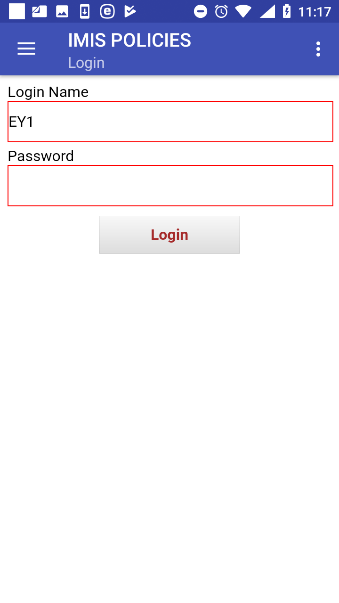
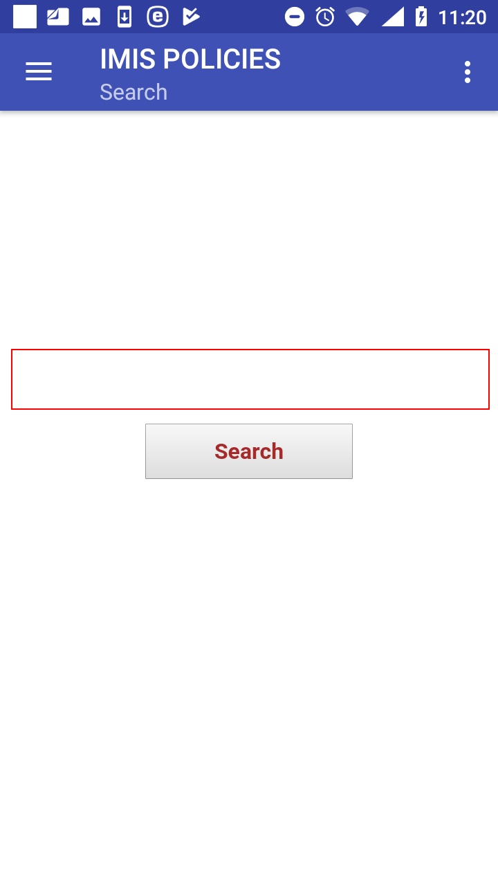
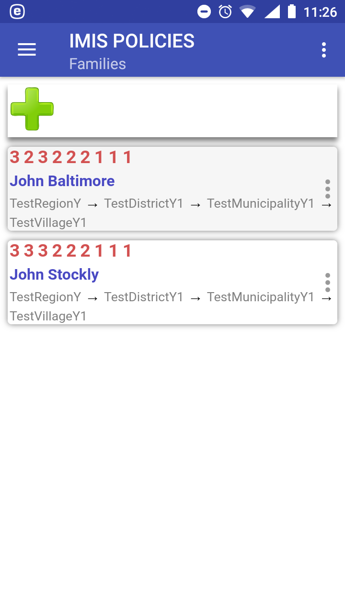
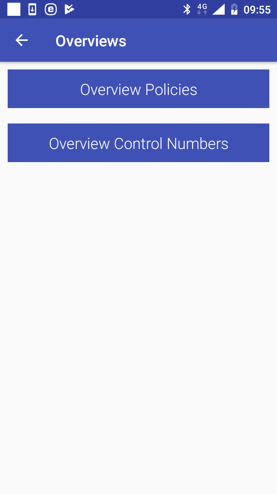
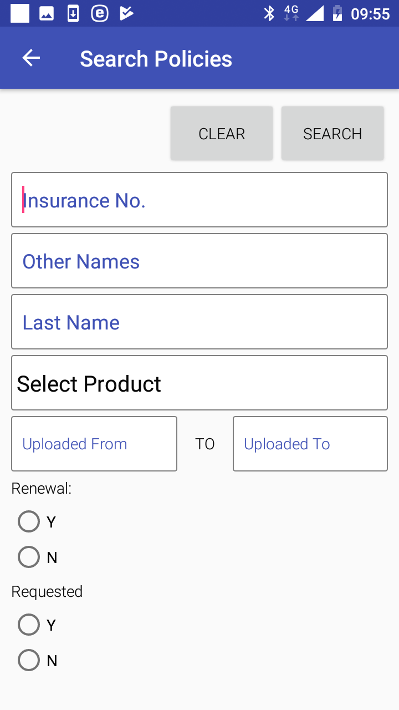
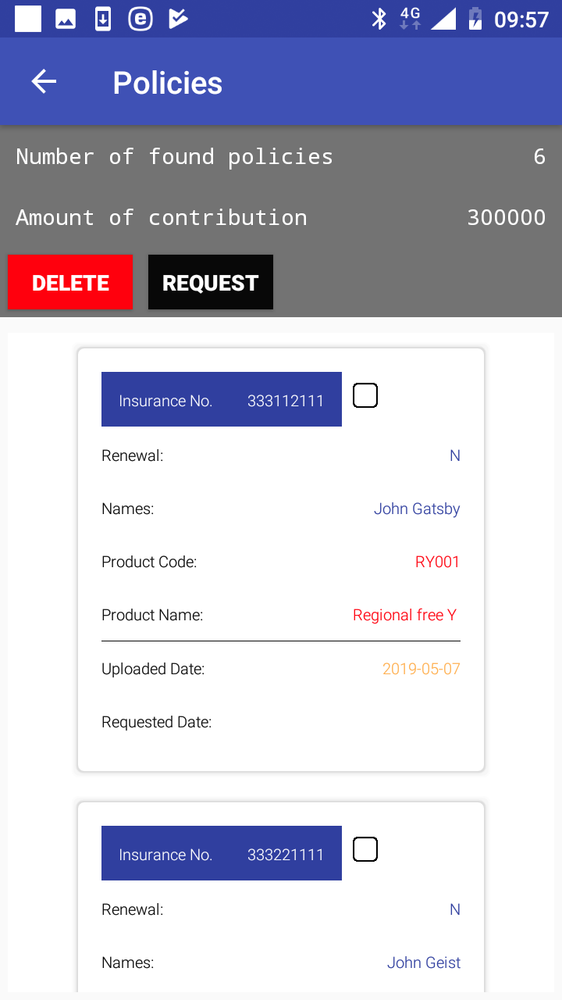
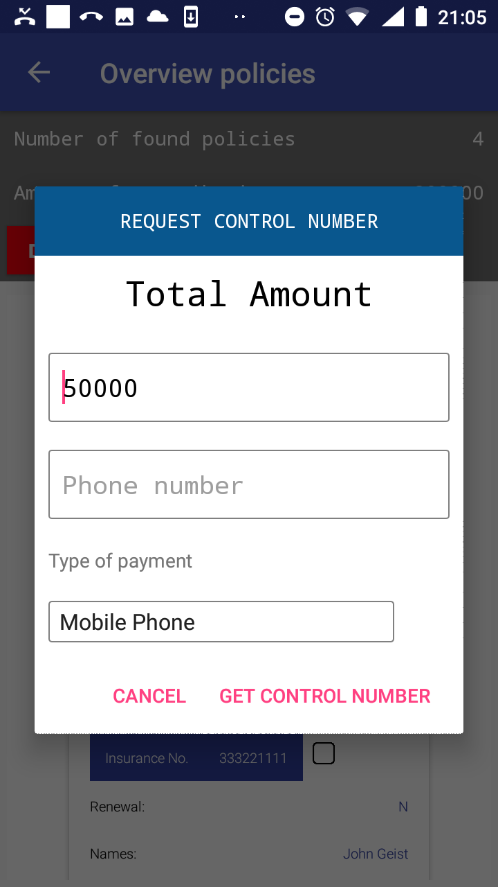
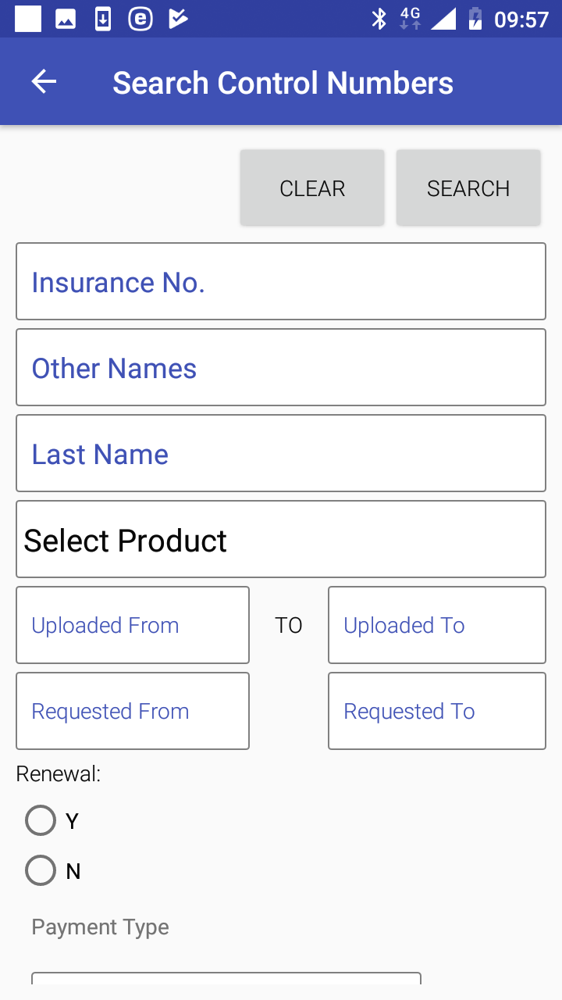
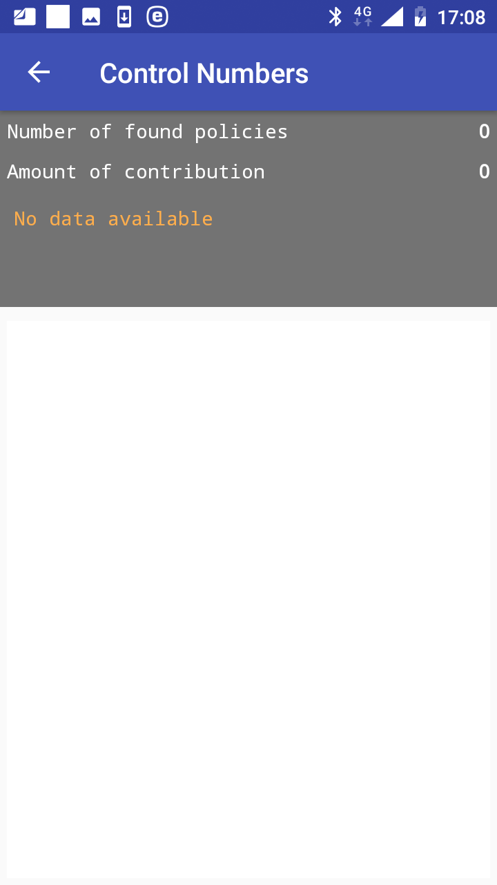

**Function Modify**
-------------------

The function Modify is navigated to by clicking on the menu item
**Modify** in the main menu. The function Modify allows to download data
on families/insurees from the web IMIS for their further editing or
using for association with policies. A user must have a valid User Name
and Password provided by an administrator of the web IMIS with an
assigned role incorporating an access to the functionality **Insurees
and Families/Family +Insurees/Edit** as an access to the functionality
Modify is guarded by the `Login
Page <#image-1.5.1-modify-function-login-page>`__

Image 1.5.1 (Modify function-Login Page)
^^^^^^^^^^^^^^^^^^^^^^^^^^^^^^^^^^^^^^^^

If login is successful the `Search Page <#image-1.5.2-search-page>`__
appears:

Image 1.5.2 (Search Page)
^^^^^^^^^^^^^^^^^^^^^^^^^

Enter the insurance number of any member of a family/group having a
residence in the district where the enrolment officer is acting and
click on the button **Search**. If the family/group with a member having
the entered insurance number is found in the web IMIS, the `Family
Page <#image-1.5.3-family-page-with-the-retrieved-family>`__ appears
with the retrieved family.

Image 1.5.3 (Family Page with the retrieved family)
^^^^^^^^^^^^^^^^^^^^^^^^^^^^^^^^^^^^^^^^^^^^^^^^^^^

From now on, any operations like editing of members and deleting members
of the family/group, associating new policies and contributions can be
accomplished in the same way as for newly entered families as described
with the function `Enrol <#function-enrol>`__.

**Function Control Numbers**
----------------------------

The function Control Numbers is navigated to by clicking on the menu
item **Control Numbers** in the main menu. The function Control Number
allows sending requests for assigning of control numbers for intended
payments of contributions and getting assigned control numbers. A user
must have a valid User Name and Password provided by an administrator of
the web IMIS with an assigned role incorporating an access to the
functionality **Insurees and Families/Payment/Add** as an access to the
functionality Control Numbers is guarded by the by the `Login
Page <#image-1.2.1-enquire-function-login-page>`__.

The `Overviews Page <#image-1.6.1-overviews-page>`__ appears after
selecting **Contrl Numbers** in the main menu:

Image 1.6.1 (Overviews Page)
^^^^^^^^^^^^^^^^^^^^^^^^^^^^

Click on the button **Overview Policies** to move to the `Search
Policies Page <#image-1.6.2-search-policies-page>`__ with search
criteria for policies in the memory of the device:

Image 1.6.2 (Search Policies Page)
^^^^^^^^^^^^^^^^^^^^^^^^^^^^^^^^^^

The application keeps track of all policies that were created within the
application and/or uploaded unless the track of a policy is explicitly
deleted by a user (see below). This feature allows to send requests for
assigning control numbers for one or several policies simultaneously to
the web IMIS before or after the policies are uploaded (after uploading
is a preferred option).

The following search criteria are at disposal:

-  Insurance No.

..

   Enter an insurance number (or a subset of) of the head of
   family/group holding searched policies.

-  Other Names

..

   Enter another name (or a subset of) of the head of family/group
   holding searched policies.

-  Last Names

..

   Enter a last name (or a subset of) of the head of family/group
   holding searched policies.

-  Insurance Product

..

   Select from the list of available insurance products of searched
   policies.

-  Uploaded From

..

   Select from the date selector the lowest date of uploading to the web
   IMIS of searched policies.

-  Uploaded To

..

   Select from the date selector the highest date of uploading to the
   web IMIS of searched policies.

-  Renewal Y/N

..

   Select whether only renewed or only new policies are search for.
   Optional.

-  Requested Y/N

..

   Select whether only policies for which a control number has been
   requested or only policies for which a control number hasn’t been
   requested yet. Optional.

Click on the button **Clear** to clear all search criteria entered.

Click on the button **Search** to get a list of policies satisfying the
search criteria. The `Policies Page <#image-1.6.3-policies-page>`__ with
the list of policies satisfying the search criteria appears:

Image 1.6.3 (Policies Page)
^^^^^^^^^^^^^^^^^^^^^^^^^^^

The following data are included with each policy:

-  Insurance No.

..

   Read-only data field. The insurance number of the head of a
   family/group holding a policy.

-  Renewal

..

   Read-only data field. An indication whether it is a new policy (N) or
   a renewal (Y).

-  Names

..

   Read-only data field. The full name (the other and the full name) of
   the head of the family/group holding the policy.

-  Product Code

..

   Read-only data field. The code of the insurance product of the
   policy.

-  Product Name

..

   Read-only data field. The name of the insurance product of the
   policy.

-  Uploaded Date

..

   Read-only data field. The date of uploading of the policy if it has
   been uploaded.

-  Requested Date

..

   Read-only data field. The date of requesting a control number for the
   policy if it has been requested.

-  Checkbox

..

   Check the box if the policy should be included in a subsequent
   operation (**Delete, Request**).

Click on the button **Delete** if the selected policies should be
deleted from the list of policies.

Click on the button **Request** if assignment of a control number for
the selected policies should be performed. The `Request Control Number
Page <#image-1.6.4-request-control-number-page>`__ appears.

Image 1.6.4 (Request Control Number Page)
^^^^^^^^^^^^^^^^^^^^^^^^^^^^^^^^^^^^^^^^^

The following data items are included:

-  Total Amount

..

   The total amount of contributions associated with the selected
   policies for the request.

-  Phone Number

..

   The phone number of the requester/user where a SMS with the assigned
   control number should be sent.

-  Type of Payment

..

   Select one of the two relevant types of payment (**Mobile Phone, Bank
   Transfer**).

   Click on button **Get Control Number**. The `Login
   Page <#image-1.6.5-request-control-number-login-page>`__ appears:

   .. image:: media/image35.png

Image 1.6.5 (Request Control Number – Login Page)
^^^^^^^^^^^^^^^^^^^^^^^^^^^^^^^^^^^^^^^^^^^^^^^^^

If the application successfully logs in the `Policies
Page <#image-1.6.3-policies-page>`__ appears again.

Click on the icon **<-** in the upper part of the `Policies
Page <#image-1.6.3-policies-page>`__ to return to the `Search Policies
Page <#image-1.6.2-search-policies-page>`__.

Click on the button **Overview Control Numbers** to move to the `Search
Control Numbers Page <#image-1.6.2-search-policies-page>`__ with search
criteria for assigned control numbers:

Image 1.6.4 (Search Control Numbers Page)
^^^^^^^^^^^^^^^^^^^^^^^^^^^^^^^^^^^^^^^^^

Searching is done based on policies to which control numbers are
assigned. The following search criteria are at disposal:

-  Insurance No.

..

   Enter an insurance number (or a subset of) of the head of
   family/group holding searched policies.

-  Other Names

..

   Enter another name (or a subset of) of the head of family/group
   holding searched policies.

-  Last Names

..

   Enter a last name (or a subset of) of the head of family/group
   holding searched policies.

-  Insurance Product

..

   Select from the list of available insurance products of policies of
   which control numbers are searched for.

-  Uploaded From

..

   Select from the date selector the lowest date of uploading to the web
   IMIS of searched policies.

-  Uploaded To

..

   Select from the date selector the highest date of uploading to the
   web IMIS of searched policies.

-  Renewal Y/N

..

   Select whether only renewed or only new policies are search for.
   Optional.

-  Payment Type

..

   Select one of possible type of payment (Bank Transfer, **Mobile
   Phone**). Optional.

Click on the button **Clear** to clear all search criteria entered.

Click on the button **Search** to get a list of policies satisfying the
search criteria and assigned control numbers. The `Control Numbers
Page <#image-1.6.5-control-numbers-page>`__ with the list of policies
satisfying the search criteria and assigned control numbers appears:

Image 1.6.5 (Control Numbers Page)
^^^^^^^^^^^^^^^^^^^^^^^^^^^^^^^^^^

Click on the icon **<-** in the upper part of the `Control Numbers
Page <#image-1.6.5-control-numbers-page>`__ to return to the `Search
Control Numbers Page <#image-1.6.4-search-control-numbers-page>`__ .