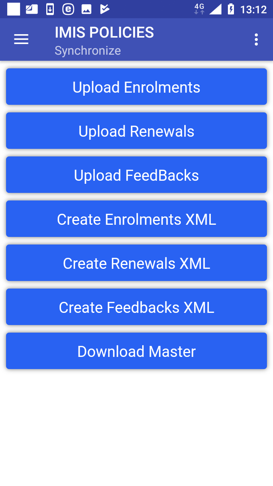

Off-line mode of IMIS Policies
------------------------------

The following table gives an overview of functions according to their
requirements towards Internet connectivity and possible off-line
substitutions.

+----------------------+------------------------+----------------------+
| IMIS Policies        |                        |                      |
+======================+========================+======================+
| Functionality        | connectivity required  | Off-line             |
|                      | /autonomous            | substitution         |
+----------------------+------------------------+----------------------+
| Initial launching    | connectivity required  | yes, by off-line     |
|                      |                        | transfer of the      |
|                      |                        | Master Data          |
+----------------------+------------------------+----------------------+
| Enquire              | connectivity required  | not available        |
+----------------------+------------------------+----------------------+
| Acquire              | autonomous             | not needed           |
+----------------------+------------------------+----------------------+
| Enrol                | autonomous             | not needed           |
+----------------------+------------------------+----------------------+
| Modify               | connectivity required  | not available        |
+----------------------+------------------------+----------------------+
| Control Numbers      | connectivity required  | not available        |
+----------------------+------------------------+----------------------+
| Renew                | connectivity required  | yes, by off-line     |
|                      |                        | transfer of the      |
|                      |                        | Renewal Data         |
+----------------------+------------------------+----------------------+
| Feedback             | connectivity required  | yes, by off-line     |
|                      |                        | transfer of the      |
|                      |                        | Feedback Data        |
+----------------------+------------------------+----------------------+
| Reports              | connectivity required  | not available        |
+----------------------+------------------------+----------------------+
| Synchronize          | connectivity required  | yes, off-line        |
|                      |                        | synchronization by   |
|                      |                        | XML files            |
+----------------------+------------------------+----------------------+
| Quit                 | autonomous             | not needed           |
+----------------------+------------------------+----------------------+
| About                | autonomous             | not needed           |
+----------------------+------------------------+----------------------+

Creation and transfer of off-line files to IMIS Policies
~~~~~~~~~~~~~~~~~~~~~~~~~~~~~~~~~~~~~~~~~~~~~~~~~~~~~~~~

The off-line files for IMIS Policies is created in the web IMIS by
selecting of the **Tools/Extracts** menu item. The form IMISExtracts is
displayed.

   .. image:: media/image74.png
      :width: 5.70281in
      :height: 4.1126in

Image 3.1.1 (IMISExtracts Form)
^^^^^^^^^^^^^^^^^^^^^^^^^^^^^^^

The Download Master Section is used for creation of the off-line files
for IMIS Policies.

-  Enrolment Officer Code

..

   The code of an enrolment officer for whom the off-line files should
   be generated.

Click on the button:

-  **Download Master Data**

..

   The file MasterData.rar is generated.

-  **Download Renewals**

..

   The file Renewals_<enrolment officer code>.RAR is generated. It
   contains renewal prompts associated with the enrolment officer at the
   time.

-  **Download Feedbacks**

..

   The file Feedbacks_<enrolment officer code>.RAR is generated. It
   contains feedback prompts associated with the enrolment officer at
   the time.

   The off-line files should be transferred to the device and stored in
   any folder (Renewals_<code>, Feedbacks_<code>) and in the folder
   IMIS/Database (MasterData). The off-line files Renewals_<code> and
   Feedbacks_<code> are selected by the user after swapping in the
   Renewals Page and `Feedbacks Page <#image-1.8.1-feedbacks-page>`__ .

Creation and transfer of off-line files from IMIS Policies
~~~~~~~~~~~~~~~~~~~~~~~~~~~~~~~~~~~~~~~~~~~~~~~~~~~~~~~~~~

Use the function `Synchronize <#image-3.1.2-synchronize-page>`__ and the
following buttons:

Image 3.1.2 (Synchronize Page)
^^^^^^^^^^^^^^^^^^^^^^^^^^^^^^

-  **Create Enrolments XML**

..

   Creates a file with all enrolments including policies/contributions
   that haven’t been uploaded or included in a generated file yet. It is
   required that each insuree has to have a photo associated with
   him/her. The name of the file is Enrolment_<enrolment officer
   code>_<date of creating>_<time of creating>.rar and it is stored in
   the folder IMIS/Enrolment.

-  **Create Renewals XML**

..

   Creates a file with all renewals that haven’t been uploaded or
   included in a generated file yet. The name of the file is
   MasterRenewal.rar and it is stored in the folder IMIS.

-  **Create Feedbacks XML**

..

   Creates a file with all feedbacks that haven’t been uploaded or
   included in a generated file yet. The name of the file is
   MasterFeedback.rar and it is stored in the folder IMIS.

The off-line files should be transferred to a client device of the web
IMIS and uploaded to the web IMIS by means of the `IMISExtracts
form <#image-3.1.1-imisextracts-form>`__ – in the sections Upload
Enrolment, Upload Renewal, Upload Feedback.