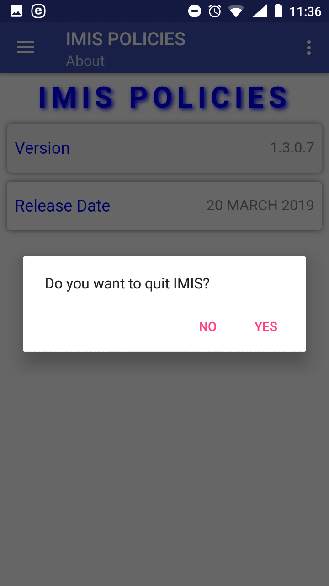
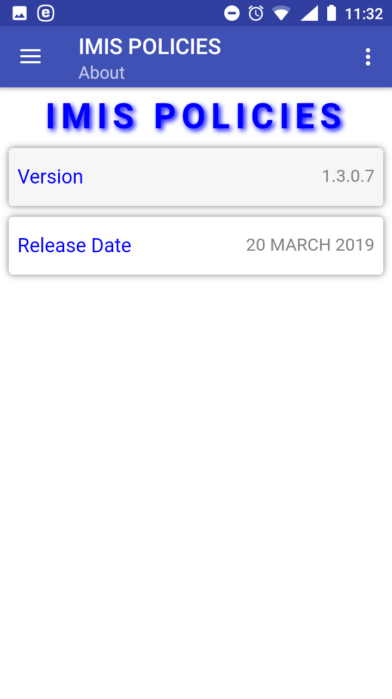

Function Quit
-------------

The function Quit is navigated to by clicking on the menu item **Quit**
in the main menu. The function Quit quits the application after `Quit
Confirmation <#image-1.11.1-quit-confirmation-prompt>`__.

Image 1.11.1 (Quit confirmation prompt)
^^^^^^^^^^^^^^^^^^^^^^^^^^^^^^^^^^^^^^^

Function About
--------------

The function About is navigated to by clicking on the menu item
**About** in the main menu. The function About provides information
about the application itself. The `About
Page <#image-1.12.1-about-page>`__ appears immediately:

Image 1.12.1 (About Page)
^^^^^^^^^^^^^^^^^^^^^^^^^

Click on the icon **<-** in the upper part of the `About
Page <#image-2.10.1-about-page>`__ to return to the `Home
Page. <#image-2.1.2-home-page>`__