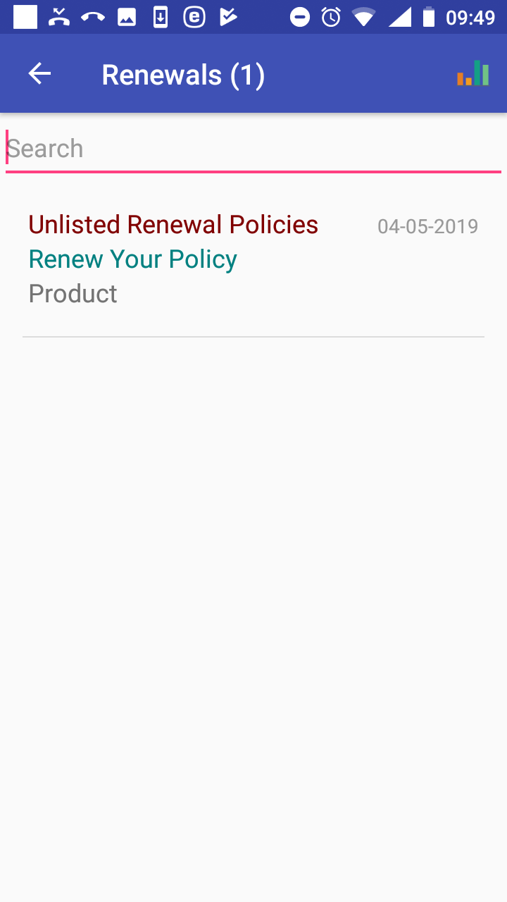
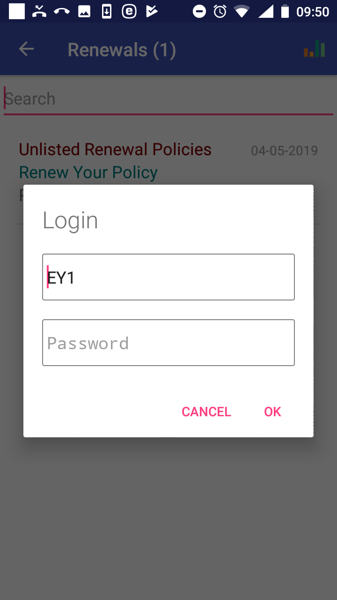
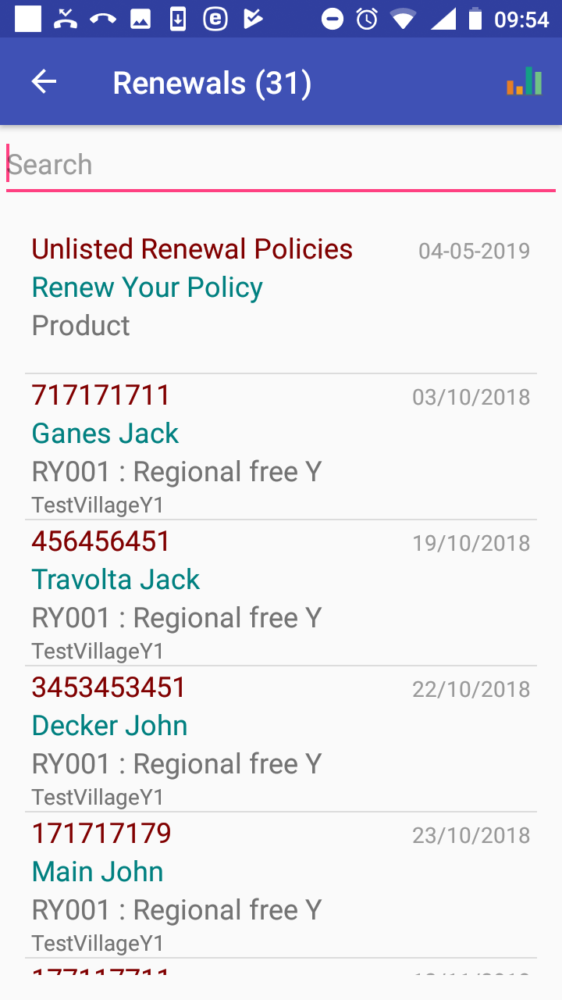
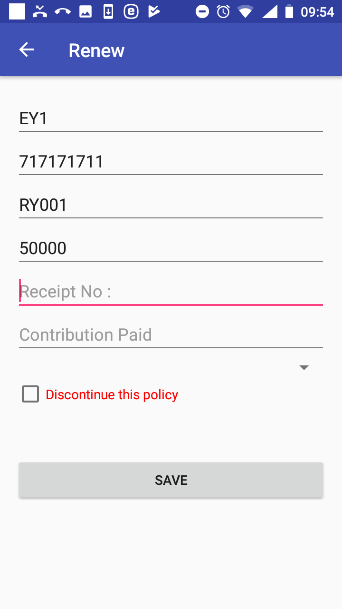

**Function Renew**
------------------

The function Renew is navigated to by clicking on the menu item
**Renew** in the main menu. The function Renew allows getting of prompts
for renewing of policies from the web IMIS and posting of renewals for
selected policies. A user must have a valid User Name and Password
provided by an administrator of the web IMIS with an assigned role
incorporating an access to the functionality **Insurees and
Familiies/Policy/Renew** as an access to the functionality Renew is
guarded by the `Login
Page <#image-1.2.1-enquire-function-login-page>`__.

The `Renewals Page <#image-1.7.1-renewals-page>`__ with the generic
prompt (Unlisted Renewal Policies) appears after selecting **Renew** in
the main menu. The generic prompt allows to the user to renew any
policy, not only policies offered by prompts transferred from the web
IMIS.

Image 1.7.1 (Renewals Page)
^^^^^^^^^^^^^^^^^^^^^^^^^^^

Swapping around the `Renewals Page <#image-1.7.1-renewals-page>`__ leads
to the `Login Page <#image-1.7.2-renewals-page-login-page>`__ and after
a successful login shows renewal prompts transferred from the web IMIS.

Image 1.7.2 (Renewals Page-Login Page)
^^^^^^^^^^^^^^^^^^^^^^^^^^^^^^^^^^^^^^

The following rules apply for selecting of policies for which renewal
prompts are displayed:

-  A policy is maintained by the enrolment officer with the enrolment
   officer code entered while launching the application.

-  The expiry date of a policy is in the past or within the fortnight
   from the current day

-  There is no policy for the same family/group and for the same
   insurance product active after the expiry date of the policy to be
   prompted.

The `Renewal Page <#image-1.7.3-renewals-page-with-displayed-prompts>`__
with prompts appears after the swap and the successful login.

Image 1.7.3 (Renewals Page with displayed prompts)
^^^^^^^^^^^^^^^^^^^^^^^^^^^^^^^^^^^^^^^^^^^^^^^^^^

Each renewal prompt contains the following data items:

-  Insurance Number

..

   The insurance number of the head of a family/group who holds the
   policy to be renewed.

-  Name and Other Names

..

   The full name of the head of the family/group.

-  Insurance Product

..

   The code and the name of an insurance product with which the policy
   should be renewed.

-  Village

..

   The village of residence of the family/group.

-  Period

..

   The period in which health care was provided.

The list of prompts can be temporarily reduced by entering a string in
the **Search** field. Clicking on a selected prompt results in
displaying of the `Renew
Page <#image-1.7.4-renew-page---a-specific-prompt>`__.

Image 1.7.4 (Renew Page - a specific prompt)
^^^^^^^^^^^^^^^^^^^^^^^^^^^^^^^^^^^^^^^^^^^^

The following data fields are displayed:

-  Enrolment Officer Code

..

   Read-only data field. Pre-filled by the code of an enrolment officer
   with which the application is launched.

-  Insurance Number

..

   Read-only data field for a specific prompt. Pre-filled by the
   insurance number from the prompt. For the generic prompt, enter the
   insurance number for the policy to be renewed. Mandatory.

-  Select Insurance Product

..

   Read-only data field for a specific prompt. Pre-filled by the
   insurance product from the prompt. For the generic prompt, select
   from the drop down list the insurance product with which the policy
   renewed. Mandatory.

-  Value of Renewed policy

..

   Read-only data field for a specific prompt. Pre-filled by the value
   of the renewed policy that should be covered by a contribution. This
   data field is not given for the generic prompt.

-  Receipt No.

..

   Read-only data field for a specific prompt. Pre-filled by the value
   of the renewed policy that should be covered by a contribution. This
   data field is not given for the generic prompt.

-  Contribution Paid.

..

   The amount of contribution actually paid for the renewal. Mandatory..

-  Select Payer

..

   Select a payer of the contribution from the drop down list. Optional.

-  Discontinue This Policy

..

   Check the box if the policy should be not be renewed and it should be
   excluded from the list of renewal prompts. If checked the `Renewals
   Page <#image-1.7.3-renewals-page-with-displayed-prompts>`__ is
   displayed again and the corresponding prompt is removed from the
   list. This check box is not at disposal for the generic prompt.

Click on the button **Save** to save (post) the renewal data for this
policy into the memory of the device. Subsequently it can be uploaded to
the web IMIS by the function `Synchronize <#function-synchronize-1>`__.
The `Renewals
Page <#image-1.7.3-renewals-page-with-displayed-prompts>`__ is displayed
after saving with the prompt just saved being removed.

Click on the icon **<-** in the upper part of the `Renewals
Page <#image-1.7.3-renewals-page-with-displayed-prompts>`__ to return to
the `Home Page <#image-1.1.2-home-page>`__ .