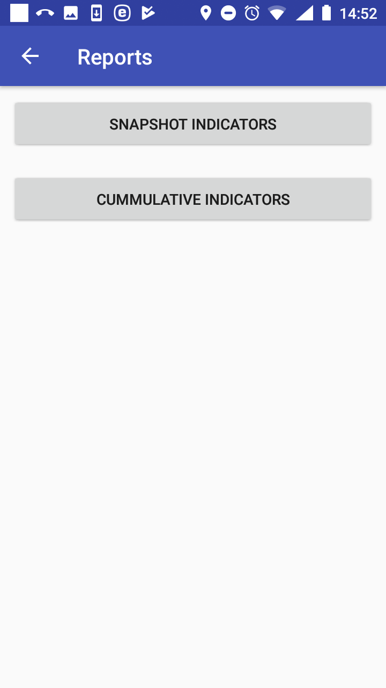
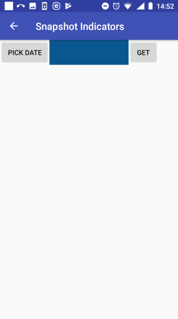
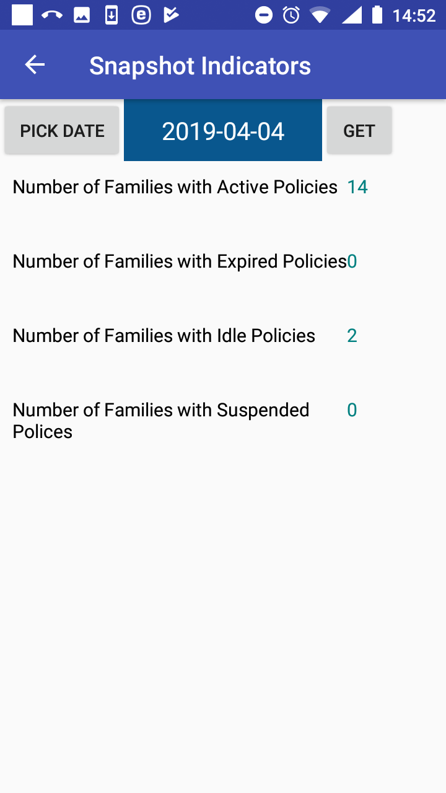
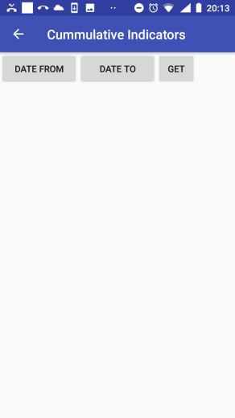
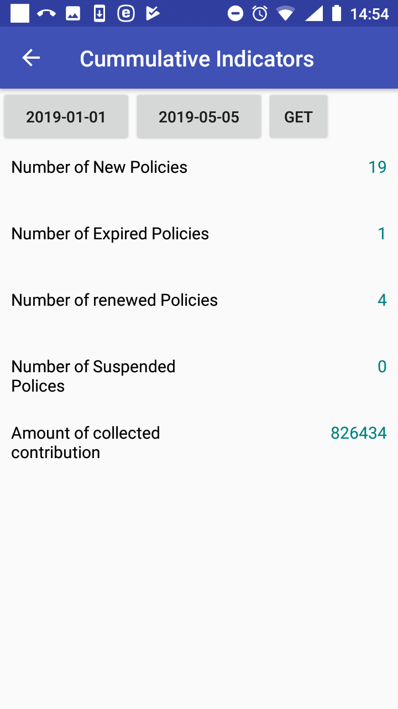

Function Reports
----------------

The function Reports is navigated to by clicking on the menu item
**Reports** in the main menu. The function Reports provides basic
statistics on the numbers families/insurees/policies associated with the
enrolment officer. The `Report Page <#image-2.3.1-map-services-page>`__
appears immediately:

Image 1.9.1 (Reports Page)
^^^^^^^^^^^^^^^^^^^^^^^^^^

Click on the button Snapshot Indicators to get data from the web IMIS on
the date of reporting. The `Snapshot Indicators
Page <#image-1.9.2-snapshot-indicators-page>`__ appears:

Image 1.9.2 (Snapshot Indicators Page)
^^^^^^^^^^^^^^^^^^^^^^^^^^^^^^^^^^^^^^

-  Pick Date

..

   Enter the date for which the snapshot statistics are required.

   Click on the button **Get** to display the statistics in the
   `Snapshot Indicators
   Page <#image-1.9.3-snapshot-indicators-page-with-statistics>`__.

Image 1.9.3 (Snapshot Indicators Page with statistics)
^^^^^^^^^^^^^^^^^^^^^^^^^^^^^^^^^^^^^^^^^^^^^^^^^^^^^^

The following indicators are provided on the date of creating of the
report:

-  Number of Families with Active Policies

..

   The number of families/groups having at least one active policy
   managed by the enrolment officer for which the expiry date is after
   or on the date of creating of the report.

-  Number of Families with Expired Policies

..

   The number of families/groups having at least one expired policy
   managed by the enrolment officer for which there is no active
   follow-up policy of the same insurance product or its converted
   product entered into the web IMIS by the date of creating of the
   report.

-  Number of Families with Idle Policies

..

   The number of families/groups having at least one idle policy managed
   by the enrolment officer for which the date of expiry is after or on
   date of creating of the report and there is no active follow-up
   policy of the same insurance product or its converted product entered
   into the web IMIS by the date of creating of the report.

-  Number of Families with Suspended Policies

..

   The number of families/groups having at least one suspended policy
   managed by the enrolment officer for which the date of expiry is
   after or on date of creating of the report and there is no active
   follow-up policy of the same insurance product or its converted
   product entered into the web IMIS by the date of creating of the
   report.

   Click on the icon **<-** in the upper part of the `Snapshot
   Indicators Page <#image-1.9.2-snapshot-indicators-page>`__ to return
   to the `Reports Page <#image-1.9.1-reports-page>`__

Click on the button Cumulative Indicators to get data from the web IMIS
on the date of reporting. The `Cumulative Indicators
Page <#image-1.9.2-snapshot-indicators-page>`__ appears:

Image 1.9.4 (Cumulative Indicators Page)
^^^^^^^^^^^^^^^^^^^^^^^^^^^^^^^^^^^^^^^^

-  Date From

..

   Enter the starting date for which the cumulative statistics are
   required.

-  Date To

..

   Enter the last date for which the cumulative statistics are required.

   Click on the button **Get** to display the statistics in the
   `Cumulative Indicators
   Page <#image-1.9.5-cumulative-indicators-page-with-statistics>`__.

Image 1.9.5 (Cumulative Indicators Page with statistics)
^^^^^^^^^^^^^^^^^^^^^^^^^^^^^^^^^^^^^^^^^^^^^^^^^^^^^^^^

   The following cumulative indicators are provided for the specified
   period:

-  Number of New Policies

The number of policies managed by the enrolment officer that were
enrolled within the specified period irrespective of their status.

-  Number of Renewed Policies

The number of policies managed by the enrolment officer that were
renewed by the renewal functionality within the specified period
irrespective of their status.

-  Number of Expired Policies

The number of policies managed by the enrolment officer that expired
within the specified period and they have no active follow-up policy of
the same insurance product or its converted product entered into IMIS by
the date of creating of the report.

-  Number of Suspended Policies

..

   The number of policies managed by the enrolment officer that were
   suspended within the specified period.

-  Amount of Collected Contributions

..

   The amount of contributions collected within the specified period for
   all policies managed by the enrolment officer.

**Remark 1:** All statistics are taken from the web IMIS irrespective
whether policies originated in the application or were entered via the
web IMIS.

**Remark 2:** The enrolment officer means the officer with the enrolment
officer code that was entered while launching the application and all of
its predecessors that he/she substituted directly or indirectly.

Click on the icon **<-** in the upper part of the `Cumulative Indictors
Page <#image-1.9.4-cumulative-indicators-page>`__ to return to the
`Reports Page <#image-1.9.1-reports-page>`__