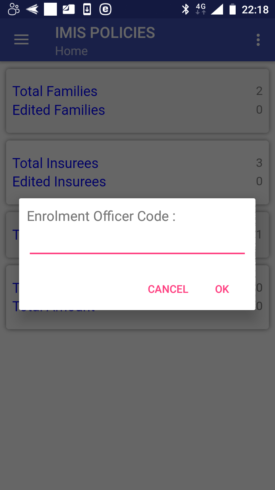
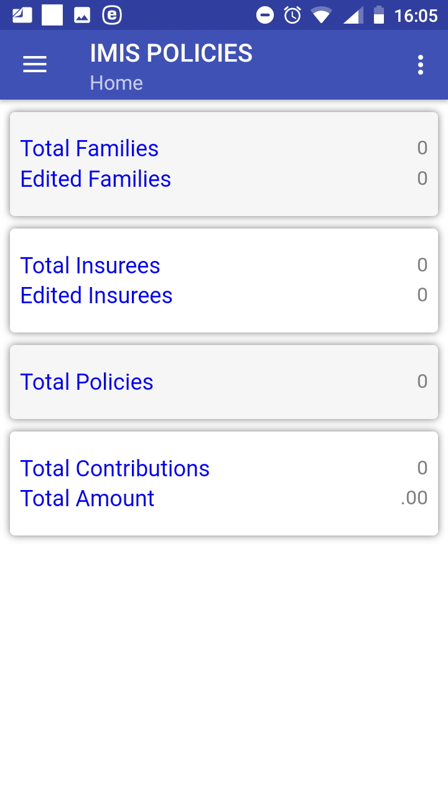
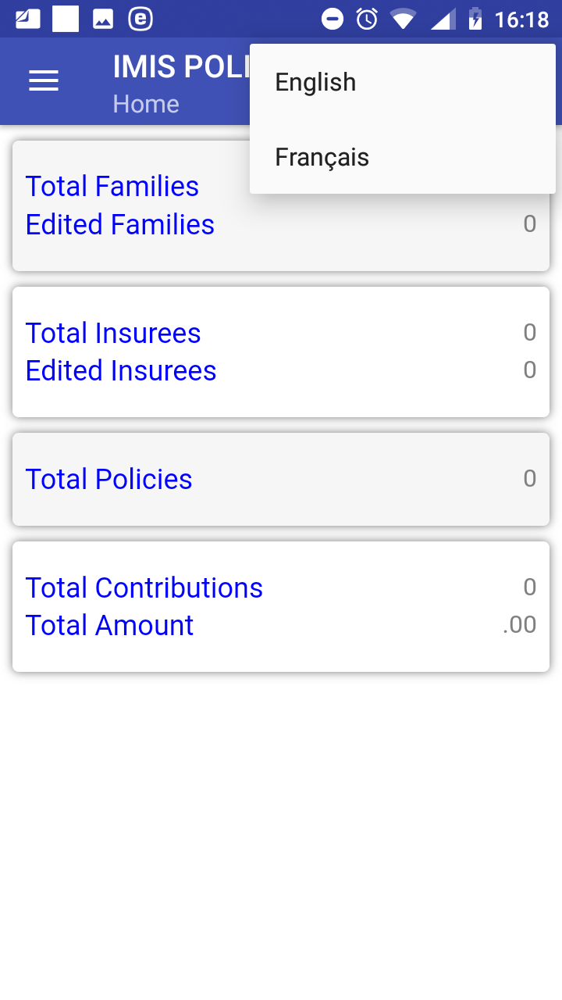
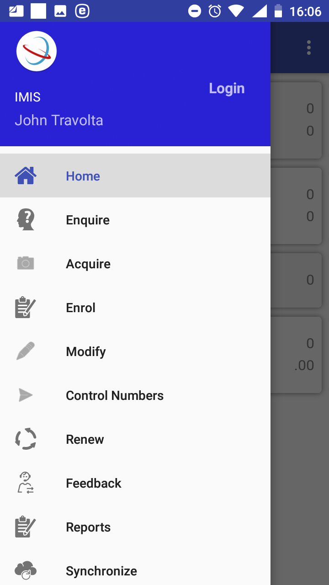

Launching of IMIS Policies
--------------------------

To launch the application IMIS Policies just click on the icon of the
application. Users must have a valid code of an enrolment officer
(present in the register of enrolment officers in the web IMIS) and they
must have a valid User Name and Password provided by an administrator of
the web IMIS for selected functionalities. The User Name data field in
login pages is prefilled with enrolment officer code entered while
launching the application. The reason is that the web IMIS can create
automatically a user record simultaneously with an entry of a new
enrolment officer into the register of enrolment officers. Such
automatically created user has its User Name equal to the enrolment
officer code. However, this prefilled User Name can re-written by any
valid User Name in the application IMIS Policies.

The `Initial Page <#image-1.1.1-initial-page>`__ will appear:

Image 1.1.1 (Initial Page)
^^^^^^^^^^^^^^^^^^^^^^^^^^

Enter a valid enrolment officer code and click on the button **OK.** If
a valid enrolment officer code is entered, the application will
re-direct to the `Home Page <#image-1.1.2-home-page>`__\ **.**

Image 1.1.2 (Home Page)
^^^^^^^^^^^^^^^^^^^^^^^

The statistics on the number of families/insurees/policies/contributions
and on the amount of contributions appears that are currently managed by
the application before their uploading to the web IMIS. The statistics
is split into two sections in the part for families and insurees: the
total numbers including both newly entered families/groups and insurees
and downloaded (from the web IMIS) families/groups and only
families/groups and insurees downloaded for editing.

Clicking on the <three dots vertically> icon in the upper right corner
the menu for selection of language of the user interface appears.

Image 1.1.3 (Menu for selection of a language)
^^^^^^^^^^^^^^^^^^^^^^^^^^^^^^^^^^^^^^^^^^^^^^

Clicking on the <three bars horizontally> icon (the upper left corner of
the `Home Page <#image-1.1.2-home-page>`__) the main menu of the
application appears.

Image 1.1.4 (Main menu of the application)
^^^^^^^^^^^^^^^^^^^^^^^^^^^^^^^^^^^^^^^^^^

The menu items stand for the following functionalities:

`Home <#launching-of-imis-policies>`__ – return to the Home Page

`Enquire <#function-enquire>`__ – getting a photo and information on the
coverage of an insuree

`Acquire <#function-acquire>`__ – taking a photo of an insure

`Enrol <#image-1.4.13-families-and-policies-page-the-menu-associated-with-the-policy>`__
– entering or editing data on families/insurees and entering data on new
policies and contributions

`Modify <#function-modify>`__ – downloading data of families/insurees
from the web IMIS

`Control Numbers <#function-control-numbers>`__ – acquiring of control
numbers for electronic payments of contributions

`Renew <#function-renew>`__ – renewing of policies

`Feedback <#function-feedback>`__ –providing a feedback on provided
health care

`Reports <#_Function_Reports_1>`__ – providing reports relevant to
activities of an enrolment officer

`Synchronize <#function-synchronize>`__ – uploading data to the web IMIS

`Quit <#function-quit>`__ –quitting of the application

`About <#image-1.11.1-quit-confirmation-prompt>`__ – info on the version
of the installed application