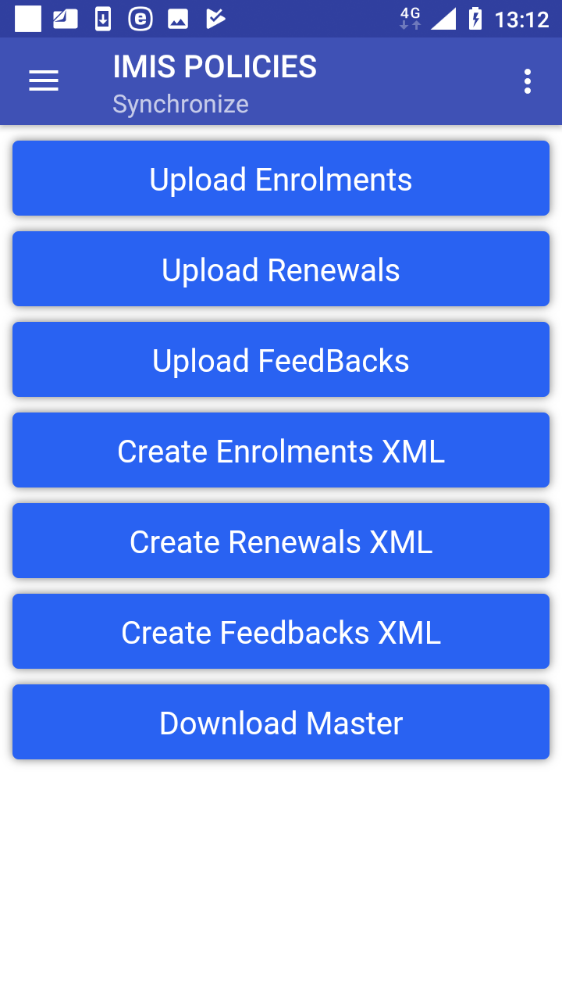

Function Synchronize
--------------------

The function Synchronize is navigated to by clicking on the menu item
**Synchronize** in the main menu. The function Synchronize uploads
posted enrolments/renewals/feedbacks to the web IMIS. For on-line
uploading a user must have a valid User Name and Password provided by an
administrator of the web IMIS with an assigned role incorporating an
access to the functionality **Insurees and Familiies/Family
+Insuree+Policy+Contribution/Add+Edit** as an access to the
functionality Synchronize is guarded by the `Login
Page <#image-1.2.1-enquire-function-login-page>`__ for on-line uploads.

The `Synchronize Page <#image-2.3.1-map-services-page>`__ appears
immediately:

Image 1.10.1 (Synchronize Page)
^^^^^^^^^^^^^^^^^^^^^^^^^^^^^^^

   Clicking on any of the buttons **Upload Enrolments, Upload Renewals,
   Upload Feedbacks** the `Login
   Page <#image-1.6.5-request-control-number-login-page>`__ appears.

   .. image:: media/image52.png

Image 1.10.2 (Synchronize Page – Login Page)
^^^^^^^^^^^^^^^^^^^^^^^^^^^^^^^^^^^^^^^^^^^^

If the application successfully logs in the `Synchronize
Page <#image-1.10.1-synchronize-page>`__ appears again with the
following buttons:

-  **Upload Enrolments**

..

   Uploads all enrolments including policies/contributions that haven’t
   been uploaded yet. It is required that each uploaded insuree has to
   have a foto associated with him/her.

-  **Upload Renewals**

..

   Uploads all renewals that haven’t been uploaded yet.

-  **Upload Feedbacks**

..

   Uploads all feedbacks that haven’t been uploaded yet.

-  **Download Master**

..

   Updates the master data in the device from the web IMIS. This update
   doesn’t require a login; nevertheless after the update entering of
   the enrolment officer code is required.

Another buttons in the `Synchronize
Page <#image-1.10.1-synchronize-page>`__ relate to the off-line mode of
the application and they are described
`elsewhere <#off-line-mode-of-imis-policies>`__.